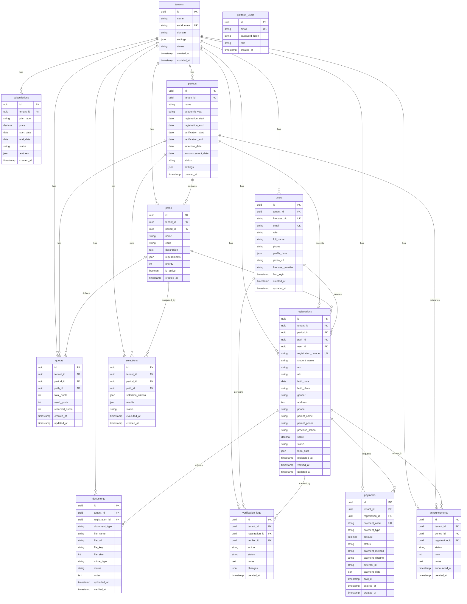

# Technical Design Document (TDD) - PPDB SaaS Platform

**Version:** 1.0.0  
**Date:** 2025-12-22 (Updated)
**Status:** Draft

## Overview

### Tech Stack Summary
- **Frontend:** SvelteKit + Tailwind CSS
- **Backend:** Cloudflare Workers + Hono
- **Database:** Neon PostgreSQL (Multi-tenant)
- **Cache:** Cloudflare D1 (SQLite for caching)
- **Storage:** Cloudflare R2
- **Payment Gateway:** Midtrans / Xendit
- **Infrastructure:** Cloudflare Workers
- **Authentication:** Firebase Authentication

### System Purpose
Platform SaaS multi-tenant untuk mengelola Penerimaan Peserta Didik Baru (PPDB) yang dapat digunakan oleh banyak sekolah dengan isolasi data dan konfigurasi independen.

---

## 1A. Domain & Subdomain Architecture

### URL Structure


### Subdomain Routing Flow


### Tenant Resolution Middleware


---

## 1B. User Account & SSO Architecture

### Global Account System


### SSO Flow (Single Sign-On)


## 1C. Multi-School Registration Configuration

### Registration Rules per Tenant


### Registration Validation Flow


### Configuration: Tenant Settings

```json
{
  "tenant_id": "uuid",
  "registration_settings": {
    "school_type": "negeri|swasta",
    "max_registrations_per_user": 1,
    "allow_multiple_paths": false,
    "require_payment": true,
    "registration_fee": 150000,
    "allowed_school_origins": ["SD", "MI"],
    "min_age": 12,
    "max_age": 15
  }
}
```

---

## 1D. Registration Form Fields Specification

### Form Structure Overview


### Step 1: Pilih Jalur Pendaftaran

| Field | Type | Required | Validation |
|-------|------|----------|------------|
| path_id | Select | Yes | Must be active path with available quota |

### Step 2: Data Pribadi Siswa

| Field | Type | Required | Validation |
|-------|------|----------|------------|
| student_name | Text | Yes | Min 3 chars, alphabetic + space |
| nisn | Text | Yes | Exactly 10 digits |
| nik | Text | Yes | Exactly 16 digits |
| birth_place | Text | Yes | Min 3 chars |
| birth_date | Date | Yes | Age validation based on school level |
| gender | Select | Yes | L/P |
| religion | Select | Yes | Islam/Kristen/Katolik/Hindu/Buddha/Konghucu |
| address | Textarea | Yes | Min 20 chars |
| rt | Text | Yes | Max 3 digits |
| rw | Text | Yes | Max 3 digits |
| kelurahan | Text | Yes | Min 3 chars |
| kecamatan | Text | Yes | Min 3 chars |
| city | Select | Yes | From master data |
| province | Select | Yes | From master data |
| postal_code | Text | Yes | Exactly 5 digits |
| student_phone | Text | No | Indonesian phone format |
| student_email | Email | No | Valid email format |

### Step 3: Data Orang Tua/Wali

| Field | Type | Required | Validation |
|-------|------|----------|------------|
| father_name | Text | Yes | Min 3 chars |
| father_nik | Text | Yes | 16 digits |
| father_occupation | Select | Yes | From occupation list |
| father_income | Select | No | Income range |
| father_education | Select | No | Education level |
| mother_name | Text | Yes | Min 3 chars |
| mother_nik | Text | Yes | 16 digits |
| mother_occupation | Select | Yes | From occupation list |
| mother_income | Select | No | Income range |
| mother_education | Select | No | Education level |
| guardian_name | Text | Conditional | If different from parents |
| guardian_relation | Select | Conditional | Relation type |
| guardian_phone | Text | Conditional | Phone format |
| parent_phone | Text | Yes | Indonesian phone format |
| parent_email | Email | Yes | Valid email, for notifications |

### Step 4: Data Asal Sekolah

| Field | Type | Required | Validation |
|-------|------|----------|------------|
| school_origin_name | Autocomplete | Yes | From NPSN database or manual |
| school_origin_npsn | Text | Yes | 8 digits |
| school_origin_address | Text | Yes | Min 10 chars |
| school_origin_city | Select | Yes | From master data |
| school_origin_province | Select | Yes | From master data |
| graduation_year | Select | Yes | Current year or next year |

### Step 5: Data Khusus per Jalur

#### Jalur Zonasi

| Field | Type | Required | Validation |
|-------|------|----------|------------|
| home_latitude | Hidden | Yes | From map picker |
| home_longitude | Hidden | Yes | From map picker |
| home_address_detail | Textarea | Yes | Verified address |
| distance_to_school | Auto | Yes | Calculated from coordinates |
| domicile_proof_type | Select | Yes | KK/Surat Domisili/Lainnya |

#### Jalur Prestasi Akademik

| Field | Type | Required | Validation |
|-------|------|----------|------------|
| semester_1_avg | Number | Yes | 0-100 |
| semester_2_avg | Number | Yes | 0-100 |
| semester_3_avg | Number | Yes | 0-100 |
| semester_4_avg | Number | Yes | 0-100 |
| semester_5_avg | Number | Yes | 0-100 |
| overall_average | Auto | Yes | Calculated |
| un_score | Number | Conditional | If applicable, 0-100 |

#### Jalur Prestasi Non-Akademik

| Field | Type | Required | Validation |
|-------|------|----------|------------|
| achievement_type | Select | Yes | Olahraga/Seni/Olimpiade/Lainnya |
| achievement_name | Text | Yes | Competition/achievement name |
| achievement_level | Select | Yes | Kecamatan/Kabupaten/Provinsi/Nasional/Internasional |
| achievement_rank | Select | Yes | Juara 1/2/3/Harapan/Peserta |
| achievement_year | Number | Yes | Within last 3 years |
| achievement_organizer | Text | Yes | Organizing institution |
| additional_achievements | Array | No | Can add multiple |

#### Jalur Afirmasi

| Field | Type | Required | Validation |
|-------|------|----------|------------|
| assistance_type | Select | Yes | KIP/PKH/KKS/Lainnya |
| assistance_number | Text | Yes | Card number |
| assistance_valid_until | Date | Yes | Must be valid |

#### Jalur Perpindahan Orang Tua

| Field | Type | Required | Validation |
|-------|------|----------|------------|
| parent_institution | Text | Yes | Institution name |
| parent_position | Text | Yes | Position/rank |
| mutation_number | Text | Yes | SK number |
| mutation_date | Date | Yes | Within last 6 months |
| previous_city | Select | Yes | Origin city |
| destination_city | Select | Yes | Must match school city |

#### Jalur Anak Guru/Tendik

| Field | Type | Required | Validation |
|-------|------|----------|------------|
| employee_name | Text | Yes | Parent name |
| employee_nip | Text | Conditional | If PNS |
| employee_nuptk | Text | Yes | NUPTK number |
| employee_position | Text | Yes | Position |
| employee_school | Text | Yes | School where employed |
| employee_school_npsn | Text | Yes | 8 digits |
| employee_relation | Select | Yes | Anak Kandung/Anak Angkat |

### Step 6: Upload Dokumen

| Document | Type | Required For | Max Size | Format |
|----------|------|--------------|----------|--------|
| Pas Foto 3x4 | Image | All | 500KB | JPG, PNG |
| Akta Kelahiran | Document | All | 2MB | PDF, JPG |
| Kartu Keluarga | Document | All | 2MB | PDF, JPG |
| Ijazah/SKL | Document | All | 2MB | PDF, JPG |
| Rapor | Document | All | 5MB | PDF |
| KTP Orang Tua | Document | All | 2MB | PDF, JPG |
| Surat Domisili | Document | Zonasi | 2MB | PDF, JPG |
| Sertifikat Prestasi | Document | Prestasi Non-Akademik | 2MB | PDF, JPG |
| Kartu KIP/PKH | Document | Afirmasi | 2MB | PDF, JPG |
| SK Mutasi | Document | Perpindahan Ortu | 2MB | PDF, JPG |
| SK Kepegawaian | Document | Anak Guru | 2MB | PDF, JPG |

### Step 7: Review & Submit


---

## 1. System Architecture

### High-Level Architecture


### C4 Context Diagram


---

## 2. Multi-tenant Architecture

### Tenant Isolation Strategy


### Multi-tenant Data Model


---

## 3. Database Schema (ERD)

### Complete Entity Relationship Diagram



---

## 4. API Architecture

### RESTful API Structure


### API Endpoint Grouping

```mermaid
graph LR
    ROOT[API Root<br/>/api/v1]
    
    subgraph "Public Endpoints"
        AUTH[/auth]
        INFO[/info]
    end
    
    subgraph "Platform Admin"
        TENANTS[/tenants]
        SUBS[/subscriptions]
    end
    
    subgraph "Tenant Endpoints"
        USERS[/users]
        PERIODS[/periods]
        PATHS[/paths]
        QUOTAS[/quotas]
        REGS[/registrations]
        DOCS[/documents]
        VERIFY[/verifications]
        PAYS[/payments]
        ANNS[/announcements]
        SELS[/selections]
    end
    
    ROOT --> AUTH
    ROOT --> INFO
    ROOT --> TENANTS
    ROOT --> SUBS
    ROOT --> USERS
    ROOT --> PERIODS
    ROOT --> PATHS
    ROOT --> QUOTAS
    ROOT --> REGS
    ROOT --> DOCS
    ROOT --> VERIFY
    ROOT --> PAYS
    ROOT --> ANNS
    ROOT --> SELS
    
    style ROOT fill:#e91e63,color:#fff
    style AUTH fill:#4caf50,color:#fff
    style TENANTS fill:#ff9800,color:#fff
```

---

## 5. Authentication & Authorization Flow

### Firebase Authentication Flow


### Role-Based Access Control (RBAC)


---

## 6. Registration Flow

### Complete Student Registration Flow


---

## 7. Verification Flow

### Document Verification by Committee


---

## 8. Selection & Announcement Flow

### Automated Selection Process

```mermaid
sequenceDiagram
    participant Admin
    participant Frontend
    participant API
    participant Selection Service
    participant Database
    participant Email
    
    Admin->>+Frontend: Access Selection Module
    Frontend->>+API: GET /api/v1/periods/{id}/stats
    API->>+Database: Get Registration Statistics
    Database-->>-API: Stats by Path
    API-->>-Frontend: Statistics
    Frontend-->>-Admin: Show Stats & Quotas
    
    Admin->>+Frontend: Configure Selection Criteria
    Note over Admin,Frontend: Set weights, thresholds, priorities
    Frontend->>+API: PUT /api/v1/selections/criteria
    API->>+Database: Save Selection Criteria
    Database-->>-API: Saved
    API-->>-Frontend: 200 OK
    Frontend-->>-Admin: Criteria Saved
    
    Admin->>+Frontend: Run Selection Process
    Frontend->>+API: POST /api/v1/selections/execute
    Note over Frontend,API: { periodId }
    
    API->>+Selection Service: Execute Selection Algorithm
    
    Selection Service->>+Database: Get All Verified Registrations
    Note over Database: Status: VERIFIED
    Database-->>-Selection Service: Registrations List
    
    loop For Each Path (by Priority)
        Selection Service->>Selection Service: Calculate Scores
        Note over Selection Service: Based on criteria:<br/>- Zonasi: Distance<br/>- Prestasi: Grades/Achievements<br/>- Others: Specific rules
        
        Selection Service->>+Database: Get Path Quota
        Database-->>-Selection Service: Quota Available
        
        Selection Service->>Selection Service: Rank Candidates
        Selection Service->>Selection Service: Select Top N (Quota)
        
        Selection Service->>+Database: Create Announcements
        Note over Database: Status: ACCEPTED / WAITING_LIST / REJECTED
        Database-->>-Selection Service: Announcements Created
    end
    
    Selection Service->>+Database: Save Selection Results
    Database-->>-Selection Service: Results Saved
    
    Selection Service->>+Database: Update Quota Usage
    Database-->>-Selection Service: Quota Updated
    
    Selection Service-->>-API: Selection Complete
    
    API->>+Email: Send Bulk Notifications
    Note over Email: Send to all participants
    Email-->>-API: Notifications Sent
    
    API-->>-Frontend: 200 OK
    Note over API,Frontend: { totalProcessed, accepted, rejected, waiting }
    Frontend-->>-Admin: Selection Complete
    
    Admin->>+Frontend: Publish Announcement
    Frontend->>+API: POST /api/v1/announcements/publish
    API->>+Database: Update Announcement Status
    Note over Database: Status: PUBLISHED
    Database-->>-API: Published
    
    API->>+Email: Send Final Notifications
    Email-->>-API: Sent
    
    API-->>-Frontend: 200 OK
    Frontend-->>-Admin: Announcement Published
```

### Announcement Viewing Flow

```mermaid
sequenceDiagram
    participant Student
    participant Frontend
    participant API
    participant Database
    
    Student->>+Frontend: Check Announcement
    Frontend->>+API: GET /api/v1/announcements/check
    Note over Frontend,API: { registrationNumber, nik }
    
    API->>+Database: Query Announcement
    Database-->>-API: Announcement Data
    
    alt Accepted
        API-->>Frontend: 200 OK
        Note over API,Frontend: { status: ACCEPTED, rank, path }
        Frontend-->>Student: Congratulations! You're Accepted
        
    else Waiting List
        API-->>Frontend: 200 OK
        Note over API,Frontend: { status: WAITING_LIST, rank }
        Frontend-->>Student: You're on Waiting List
        
    else Rejected
        API-->>Frontend: 200 OK
        Note over API,Frontend: { status: REJECTED }
        Frontend-->>-Student: Sorry, Not Accepted This Time
    end
    
    deactivate API
    deactivate Frontend
```

---

## 9. Payment Flow

### Payment Gateway Integration

```mermaid
sequenceDiagram
    participant Student
    participant Frontend
    participant API
    participant Database
    participant Midtrans/Xendit
    participant Bank
    
    Student->>+Frontend: Initiate Payment
    Frontend->>+API: POST /api/v1/payments/create
    Note over Frontend,API: { registrationId, amount, type }
    
    API->>+Database: Get Registration Details
    Database-->>-API: Registration Data
    
    API->>API: Calculate Amount
    Note over API: Based on payment type:<br/>- Registration Fee<br/>- Re-registration Fee
    
    API->>+Midtrans/Xendit: Create Transaction
    Note over API,Midtrans/Xendit: {<br/>  order_id,<br/>  amount,<br/>  customer_details,<br/>  callbacks<br/>}
    Midtrans/Xendit-->>-API: Transaction Created
    Note over Midtrans/Xendit,API: {<br/>  payment_code,<br/>  payment_url,<br/>  expired_at<br/>}
    
    API->>+Database: Save Payment Record
    Note over Database: Status: PENDING
    Database-->>-API: Payment Saved
    
    API-->>-Frontend: 201 Created
    Note over API,Frontend: {<br/>  paymentCode,<br/>  paymentUrl,<br/>  amount,<br/>  expiredAt,<br/>  instructions<br/>}
    Frontend-->>-Student: Show Payment Page
    
    alt Virtual Account
        Student->>+Bank: Transfer to VA
        Bank->>+Midtrans/Xendit: Payment Notification
        Midtrans/Xendit->>+API: Webhook Notification
        Note over Midtrans/Xendit,API: POST /api/v1/webhooks/payment
        
    else E-wallet
        Student->>+Midtrans/Xendit: Pay via E-wallet
        Midtrans/Xendit->>+API: Webhook Notification
        
    else Credit Card
        Student->>+Midtrans/Xendit: Pay via Card
        Midtrans/Xendit->>+API: Webhook Notification
    end
    
    API->>API: Verify Webhook Signature
    
    API->>+Database: Begin Transaction
    
    API->>+Database: Update Payment Status
    Note over Database: Status: PAID
    Database-->>-API: Updated
    
    API->>+Database: Update Registration Status
    Note over Database: Status: PENDING_VERIFICATION
    Database-->>-API: Updated
    
    API->>+Database: Commit Transaction
    Database-->>-API: Success
    
    API-->>-Midtrans/Xendit: 200 OK
    
    API->>Email: Send Payment Confirmation
    
    Midtrans/Xendit-->>-Student: Payment Success Notification
```

### Payment Status Check

```mermaid
graph TB
    START[Payment Created]
    PENDING[Status: PENDING]
    CHECK[Check Status]
    
    PAID[Status: PAID]
    EXPIRED[Status: EXPIRED]
    CANCELLED[Status: CANCELLED]
    FAILED[Status: FAILED]
    
    UPDATE_REG[Update Registration]
    NOTIFY[Send Notification]
    END[End]
    
    START --> PENDING
    PENDING --> CHECK
    
    CHECK -->|Payment Received| PAID
    CHECK -->|Time Expired| EXPIRED
    CHECK -->|User Cancelled| CANCELLED
    CHECK -->|Payment Error| FAILED
    
    PAID --> UPDATE_REG
    UPDATE_REG --> NOTIFY
    NOTIFY --> END
    
    EXPIRED --> NOTIFY
    CANCELLED --> NOTIFY
    FAILED --> NOTIFY
    
    style START fill:#4caf50,color:#fff
    style PENDING fill:#ff9800,color:#fff
    style PAID fill:#2196f3,color:#fff
    style EXPIRED fill:#f44336,color:#fff
    style CANCELLED fill:#9e9e9e,color:#fff
    style FAILED fill:#d32f2f,color:#fff
```

---

## 10. File Upload Flow

### Document Upload to Cloudflare R2

```mermaid
sequenceDiagram
    participant Student
    participant Frontend
    participant API
    participant Validation
    participant R2 Storage
    participant Database
    
    Student->>+Frontend: Select File to Upload
    Frontend->>Frontend: Client-side Validation
    Note over Frontend: - File size < 5MB<br/>- Allowed types: PDF, JPG, PNG<br/>- File name sanitization
    
    alt Validation Failed
        Frontend-->>Student: Show Error Message
    else Validation Success
        Frontend->>+API: POST /api/v1/documents/upload
        Note over Frontend,API: multipart/form-data<br/>{ file, registrationId, documentType }
        
        API->>+Validation: Validate File
        Validation->>Validation: Check File Type
        Validation->>Validation: Check File Size
        Validation->>Validation: Scan for Malware (Optional)
        Validation-->>-API: Validation Result
        
        alt Invalid File
            API-->>Frontend: 400 Bad Request
            Frontend-->>Student: Upload Failed
        else Valid File
            API->>API: Generate Unique File Key
            Note over API: {tenantId}/{registrationId}/{timestamp}_{filename}
            
            API->>+R2 Storage: Upload File
            Note over API,R2 Storage: PUT /bucket/{fileKey}<br/>Headers: Content-Type, Content-Length
            R2 Storage-->>-API: Upload Success
            Note over R2 Storage,API: { url, key, etag }
            
            API->>+Database: Save Document Record
            Note over Database: {<br/>  tenant_id,<br/>  registration_id,<br/>  document_type,<br/>  file_name,<br/>  file_url,<br/>  file_key,<br/>  file_size,<br/>  mime_type,<br/>  status: UPLOADED<br/>}
            Database-->>-API: Document Saved
            
            API-->>-Frontend: 201 Created
            Note over API,Frontend: { documentId, fileName, status }
            Frontend-->>-Student: Upload Success
        end
    end
    
    Student->>+Frontend: View Uploaded Document
    Frontend->>+API: GET /api/v1/documents/{id}/view
    
    API->>+Database: Get Document Details
    Database-->>-API: Document Data
    
    API->>API: Check User Permission
    
    alt Authorized
        API->>+R2 Storage: Generate Signed URL
        Note over API,R2 Storage: Temporary URL (expires in 1 hour)
        R2 Storage-->>-API: Signed URL
        
        API-->>-Frontend: 200 OK
        Note over API,Frontend: { signedUrl, expiresAt }
        
        Frontend->>+R2 Storage: GET Signed URL
        R2 Storage-->>-Frontend: File Content
        Frontend-->>-Student: Display Document
        
    else Unauthorized
        API-->>Frontend: 403 Forbidden
        Frontend-->>Student: Access Denied
    end
```

### File Storage Organization

```mermaid
graph TB
    ROOT[R2 Bucket: ppdb-documents]
    
    subgraph "Tenant Isolation"
        T1[tenant-uuid-1/]
        T2[tenant-uuid-2/]
        T3[tenant-uuid-n/]
    end
    
    subgraph "Registration Level"
        R1[registration-uuid-1/]
        R2[registration-uuid-2/]
    end
    
    subgraph "Document Types"
        D1[birth-certificate/]
        D2[family-card/]
        D3[diploma/]
        D4[photo/]
        D5[achievements/]
    end
    
    subgraph "Files"
        F1[timestamp_filename.pdf]
        F2[timestamp_filename.jpg]
    end
    
    ROOT --> T1
    ROOT --> T2
    ROOT --> T3
    
    T1 --> R1
    T1 --> R2
    
    R1 --> D1
    R1 --> D2
    R1 --> D3
    R1 --> D4
    R1 --> D5
    
    D1 --> F1
    D2 --> F2
    
    style ROOT fill:#e91e63,color:#fff
    style T1 fill:#3f51b5,color:#fff
    style R1 fill:#009688,color:#fff
    style D1 fill:#ff9800,color:#fff
    style F1 fill:#4caf50,color:#fff
```

---

## 11. Deployment Architecture

### Cloudflare Workers Deployment Architecture

```mermaid
graph TB
    subgraph "Cloudflare Global Network"
        subgraph "Edge Locations"
            E1[Edge Node: Jakarta]
            E2[Edge Node: Singapore]
            E3[Edge Node: Sydney]
            E4[Edge Node: Tokyo]
            E5[Edge Node: 300+ locations worldwide]
        end
        
        subgraph "Workers Runtime"
            WKR1[Worker Instance 1]
            WKR2[Worker Instance 2]
            WKR3[Worker Instance N]
        end
    end
    
    subgraph "Data Layer"
        KV[Cloudflare KV<br/>Global Key-Value]
        D1[Cloudflare D1<br/>SQLite at Edge]
        R2[Cloudflare R2<br/>Object Storage]
        NEON[(Neon PostgreSQL<br/>Serverless)]
    end
    
    subgraph "External Services"
        MIDTRANS[Midtrans/Xendit]
        EMAIL[SendGrid]
        FIREBASE[Firebase Auth]
    end
    
    E1 --> WKR1
    E2 --> WKR2
    E3 --> WKR3
    
    WKR1 --> KV
    WKR1 --> D1
    WKR1 --> R2
    WKR1 --> NEON
    
    WKR1 --> MIDTRANS
    WKR1 --> EMAIL
    WKR1 --> CLERK
    
    style E1 fill:#2196f3,color:#fff
    style E2 fill:#2196f3,color:#fff
    style E3 fill:#2196f3,color:#fff
    style WKR1 fill:#ff9800,color:#fff
    style KV fill:#9e9e9e,color:#fff
    style D1 fill:#ff5722,color:#fff
    style R2 fill:#e91e63,color:#fff
    style NEON fill:#9c27b0,color:#fff
```

### Wrangler Deployment Structure

```mermaid
graph TB
    subgraph "Project Structure"
        ROOT[ppdb-saas]
        APP[app/]
        WORKER[worker/]
        PUB[publish/]
    end
    
    subgraph "Wrangler Config"
        WRANGLER[wrangler.toml]
    end
    
    subgraph "Environments"
        DEV[Development<br/>Local + Preview]
        STAGING[Staging<br/>ppdb-saas-staging]
        PROD[Production<br/>ppdb-saas.com]
    end
    
    subgraph "Services"
        SVCA[Workers<br/>API Backend]
        SVCP[Pages<br/>Frontend]
        SVCR2[R2 Bucket]
        SVCD1[D1 Database]
        SVCKV[KV Namespace]
    end
    
    ROOT --> WRANGLER
    WRANGLER --> DEV
    WRANGLER --> STAGING
    WRANGLER --> PROD
    
    DEV --> SVCA
    STAGING --> SVCA
    PROD --> SVCA
    
    SVCA --> SVCR2
    SVCA --> SVCD1
    SVCA --> SVCKV
    
    SVCP --> SVCR2
    
    style ROOT fill:#ff9800,color:#fff
    style WRANGLER fill:#2196f3,color:#fff
    style DEV fill:#4caf50,color:#fff
    style STAGING fill:#ff9800,color:#fff
    style PROD fill:#f44336,color:#fff
```

### CI/CD Pipeline

```mermaid
graph LR
    subgraph "Development"
        DEV[Developer]
        GIT[Git Push]
    end
    
    subgraph "CI Pipeline"
        LINT[ESLint + Prettier]
        TEST[Vitest Tests]
        TYPE[TypeScript Check]
        BUILD[Build SvelteKit]
        SCAN[Security Scan]
    end
    
    subgraph "CD Pipeline"
        WRANGLER[Wrangler Deploy]
        PREVIEW[Preview Deployment]
        STAGING[Staging Environment]
        E2E[Playwright E2E]
        PROD[Production Deploy]
    end
    
    subgraph "Monitoring"
        ANALYTICS[Cloudflare Analytics]
        LOGS[Workers Logs]
        METRICS[Custom Metrics]
        ALERTS[Alerts]
    end
    
    DEV --> GIT
    GIT --> LINT
    LINT --> TEST
    TEST --> TYPE
    TYPE --> BUILD
    BUILD --> SCAN
    
    SCAN --> WRANGLER
    WRANGLER --> PREVIEW
    PREVIEW --> E2E
    E2E -->|Pass| PROD
    E2E -->|Pull Request| STAGING
    
    PROD --> ANALYTICS
    PROD --> LOGS
    PROD --> METRICS
    PROD --> ALERTS
    
    style DEV fill:#4caf50,color:#fff
    style GIT fill:#ff9800,color:#fff
    style BUILD fill:#2196f3,color:#fff
    style WRANGLER fill:#ff9800,color:#fff
    style PROD fill:#f44336,color:#fff
```

---

## 12. API Endpoints Specification

### Platform Admin Endpoints

| Method | Endpoint | Description | Auth | Role |
|--------|----------|-------------|------|------|
| POST | `/api/v1/auth/platform/login` | Platform admin login | None | - |
| GET | `/api/v1/tenants` | List all tenants | JWT | Super Admin |
| POST | `/api/v1/tenants` | Create new tenant | JWT | Super Admin |
| GET | `/api/v1/tenants/{id}` | Get tenant details | JWT | Super Admin |
| PUT | `/api/v1/tenants/{id}` | Update tenant | JWT | Super Admin |
| DELETE | `/api/v1/tenants/{id}` | Delete tenant | JWT | Super Admin |
| GET | `/api/v1/subscriptions` | List subscriptions | JWT | Super Admin |
| POST | `/api/v1/subscriptions` | Create subscription | JWT | Super Admin |
| PUT | `/api/v1/subscriptions/{id}` | Update subscription | JWT | Super Admin |

### Authentication Endpoints

| Method | Endpoint | Description | Auth | Role |
|--------|----------|-------------|------|------|
| POST | `/api/v1/auth/register` | Register new user | None | - |
| POST | `/api/v1/auth/login` | User login | None | - |
| POST | `/api/v1/auth/logout` | User logout | JWT | All |
| POST | `/api/v1/auth/refresh` | Refresh JWT token | JWT | All |
| POST | `/api/v1/auth/forgot-password` | Request password reset | None | - |
| POST | `/api/v1/auth/reset-password` | Reset password | None | - |
| GET | `/api/v1/auth/me` | Get current user | JWT | All |

### User Management Endpoints

| Method | Endpoint | Description | Auth | Role |
|--------|----------|-------------|------|------|
| GET | `/api/v1/users` | List users | JWT | Admin, Kepala Sekolah |
| POST | `/api/v1/users` | Create user | JWT | Admin |
| GET | `/api/v1/users/{id}` | Get user details | JWT | Admin, Kepala Sekolah |
| PUT | `/api/v1/users/{id}` | Update user | JWT | Admin, Own |
| DELETE | `/api/v1/users/{id}` | Delete user | JWT | Admin |
| PUT | `/api/v1/users/{id}/role` | Change user role | JWT | Admin |
| PUT | `/api/v1/users/{id}/status` | Activate/deactivate user | JWT | Admin |

### Period Management Endpoints

| Method | Endpoint | Description | Auth | Role |
|--------|----------|-------------|------|------|
| GET | `/api/v1/periods` | List periods | JWT | Admin, Kepala Sekolah |
| POST | `/api/v1/periods` | Create period | JWT | Admin |
| GET | `/api/v1/periods/active` | Get active period | None | - |
| GET | `/api/v1/periods/{id}` | Get period details | JWT | Admin, Kepala Sekolah |
| PUT | `/api/v1/periods/{id}` | Update period | JWT | Admin |
| DELETE | `/api/v1/periods/{id}` | Delete period | JWT | Admin |
| POST | `/api/v1/periods/{id}/activate` | Activate period | JWT | Admin |
| POST | `/api/v1/periods/{id}/close` | Close period | JWT | Admin |

### Path Management Endpoints

| Method | Endpoint | Description | Auth | Role |
|--------|----------|-------------|------|------|
| GET | `/api/v1/paths` | List paths | JWT | Admin, Committee |
| POST | `/api/v1/paths` | Create path | JWT | Admin |
| GET | `/api/v1/paths/{id}` | Get path details | JWT | Admin, Committee |
| PUT | `/api/v1/paths/{id}` | Update path | JWT | Admin |
| DELETE | `/api/v1/paths/{id}` | Delete path | JWT | Admin |
| GET | `/api/v1/paths/{id}/requirements` | Get path requirements | None | - |

### Quota Management Endpoints

| Method | Endpoint | Description | Auth | Role |
|--------|----------|-------------|------|------|
| GET | `/api/v1/quotas` | List quotas | JWT | Admin, Kepala Sekolah |
| POST | `/api/v1/quotas` | Create quota | JWT | Admin |
| GET | `/api/v1/quotas/{id}` | Get quota details | JWT | Admin, Kepala Sekolah |
| PUT | `/api/v1/quotas/{id}` | Update quota | JWT | Admin |
| DELETE | `/api/v1/quotas/{id}` | Delete quota | JWT | Admin |
| GET | `/api/v1/quotas/available` | Check available quotas | None | - |

### Registration Endpoints

| Method | Endpoint | Description | Auth | Role |
|--------|----------|-------------|------|------|
| GET | `/api/v1/registrations` | List registrations | JWT | Admin, Committee, Kepala Sekolah |
| POST | `/api/v1/registrations` | Create registration | JWT | Student |
| GET | `/api/v1/registrations/my` | Get own registrations | JWT | Student |
| GET | `/api/v1/registrations/{id}` | Get registration details | JWT | Admin, Committee, Own |
| PUT | `/api/v1/registrations/{id}` | Update registration | JWT | Student (if editable) |
| DELETE | `/api/v1/registrations/{id}` | Cancel registration | JWT | Student, Admin |
| GET | `/api/v1/registrations/check` | Check registration by number | None | - |
| GET | `/api/v1/registrations/{id}/print` | Print registration form | JWT | Own, Admin |

### Document Endpoints

| Method | Endpoint | Description | Auth | Role |
|--------|----------|-------------|------|------|
| GET | `/api/v1/documents` | List documents | JWT | Committee, Admin |
| POST | `/api/v1/documents/upload` | Upload document | JWT | Student |
| GET | `/api/v1/documents/{id}` | Get document details | JWT | Committee, Own |
| GET | `/api/v1/documents/{id}/view` | Get signed URL to view | JWT | Committee, Own |
| DELETE | `/api/v1/documents/{id}` | Delete document | JWT | Student (own), Admin |
| PUT | `/api/v1/documents/{id}/replace` | Replace document | JWT | Student |

### Verification Endpoints

| Method | Endpoint | Description | Auth | Role |
|--------|----------|-------------|------|------|
| GET | `/api/v1/verifications/pending` | List pending verifications | JWT | Committee |
| POST | `/api/v1/verifications` | Create verification action | JWT | Committee |
| GET | `/api/v1/verifications/logs/{registrationId}` | Get verification history | JWT | Committee, Admin |
| GET | `/api/v1/verifications/stats` | Get verification statistics | JWT | Admin, Kepala Sekolah |

### Payment Endpoints

| Method | Endpoint | Description | Auth | Role |
|--------|----------|-------------|------|------|
| GET | `/api/v1/payments` | List payments | JWT | Admin, Kepala Sekolah |
| POST | `/api/v1/payments/create` | Create payment | JWT | Student |
| GET | `/api/v1/payments/{id}` | Get payment details | JWT | Own, Admin |
| GET | `/api/v1/payments/check` | Check payment status | JWT | Own |
| POST | `/api/v1/webhooks/payment` | Payment webhook callback | None | - |

### Announcement Endpoints

| Method | Endpoint | Description | Auth | Role |
|--------|----------|-------------|------|------|
| GET | `/api/v1/announcements` | List announcements | JWT | Admin, Kepala Sekolah |
| GET | `/api/v1/announcements/check` | Check announcement result | None | - |
| GET | `/api/v1/announcements/{id}` | Get announcement details | JWT | Admin, Own |
| POST | `/api/v1/announcements/publish` | Publish announcements | JWT | Admin |
| GET | `/api/v1/announcements/stats` | Get announcement statistics | JWT | Admin, Kepala Sekolah |

### Selection Endpoints

| Method | Endpoint | Description | Auth | Role |
|--------|----------|-------------|------|------|
| GET | `/api/v1/selections` | List selection records | JWT | Admin, Kepala Sekolah |
| GET | `/api/v1/selections/criteria` | Get selection criteria | JWT | Admin |
| PUT | `/api/v1/selections/criteria` | Update selection criteria | JWT | Admin |
| POST | `/api/v1/selections/execute` | Execute selection process | JWT | Admin |
| GET | `/api/v1/selections/{id}/results` | Get selection results | JWT | Admin, Kepala Sekolah |

### Reporting Endpoints

| Method | Endpoint | Description | Auth | Role |
|--------|----------|-------------|------|------|
| GET | `/api/v1/reports/registrations` | Registration report | JWT | Admin, Kepala Sekolah |
| GET | `/api/v1/reports/verifications` | Verification report | JWT | Admin, Kepala Sekolah |
| GET | `/api/v1/reports/payments` | Payment report | JWT | Admin, Kepala Sekolah |
| GET | `/api/v1/reports/selections` | Selection report | JWT | Admin, Kepala Sekolah |
| GET | `/api/v1/reports/export` | Export report (CSV/Excel) | JWT | Admin, Kepala Sekolah |

---

## 13. Technology Stack Details

### Frontend Stack

| Technology | Version | Purpose |
|------------|---------|---------|
| SvelteKit | 2.x | Web framework |
| Svelte | 5.x | UI components |
| Tailwind CSS | 3.x | Styling |
| TypeScript | 5.x | Type safety |
| Vite | 5.x | Build tool |
| Zod | 3.x | Validation |

### Backend Stack

| Technology | Version | Purpose |
|------------|---------|---------|
| Cloudflare Workers | - | Edge runtime |
| Hono | 4.x | Web framework |
| Drizzle ORM | 0.30+ | Database ORM |
| TypeScript | 5.x | Type safety |
| Zod | 3.x | Validation |
| Firebase | - | Authentication |

### Database & Storage

| Technology | Purpose |
|------------|---------|
| Neon PostgreSQL 16 | Primary database (serverless) |
| Cloudflare D1 | Caching & sessions (SQLite) |
| Cloudflare R2 | Object storage |
| Cloudflare KV | Session management |

### Infrastructure

| Technology | Purpose |
|------------|---------|
| Cloudflare Workers | Edge computing platform |
| Cloudflare Pages | Frontend hosting |
| Cloudflare R2 | Object storage |
| Wrangler | Deployment CLI |

### External Services

| Service | Purpose |
|---------|---------|
| Midtrans | Primary payment gateway |
| Xendit | Alternative payment gateway |
| SendGrid | Email notifications |
| Dukcapil API | NIK validation |
| Google Maps API | Location services |

---

## 14. Security Considerations

### Data Security Measures

```mermaid
graph TB
    subgraph "Application Security"
        AUTH[JWT Authentication]
        RBAC[Role-Based Access Control]
        TENANT[Tenant Isolation]
        INPUT[Input Validation]
        XSS[XSS Prevention]
        CSRF[CSRF Protection]
    end
    
    subgraph "Database Security"
        RLS[Row Level Security]
        ENCRYPT[Encryption at Rest]
        BACKUP[Encrypted Backups]
        AUDIT[Audit Logs]
    end
    
    subgraph "Network Security"
        HTTPS[HTTPS/TLS 1.3]
        CORS[CORS Policy]
        RATE[Rate Limiting]
        WAF[Web Application Firewall]
    end
    
    subgraph "File Security"
        SCAN[Virus Scanning]
        TYPE[File Type Validation]
        SIZE[Size Limits]
        SIGNED[Signed URLs]
    end
    
    AUTH --> RBAC
    RBAC --> TENANT
    TENANT --> INPUT
    INPUT --> XSS
    XSS --> CSRF
    
    RLS --> ENCRYPT
    ENCRYPT --> BACKUP
    BACKUP --> AUDIT
    
    HTTPS --> CORS
    CORS --> RATE
    RATE --> WAF
    
    SCAN --> TYPE
    TYPE --> SIZE
    SIZE --> SIGNED
    
    style AUTH fill:#f44336,color:#fff
    style RLS fill:#9c27b0,color:#fff
    style HTTPS fill:#2196f3,color:#fff
    style SCAN fill:#4caf50,color:#fff
```

### Security Best Practices

1. **Authentication & Authorization**
   - JWT tokens with short expiration (15 minutes access, 7 days refresh)
   - Secure password hashing with bcrypt (12 rounds)
   - RBAC enforced at API level
   - Session management with Redis

2. **Data Protection**
   - All sensitive data encrypted at rest
   - TLS 1.3 for data in transit
   - Database connection encryption
   - Regular automated backups

3. **Tenant Isolation**
   - Strict tenant_id filtering in all queries
   - PostgreSQL Row Level Security policies
   - Separate storage paths per tenant
   - No cross-tenant data access

4. **Input Validation**
   - Zod schemas for all inputs
   - SQL injection prevention via Prisma
   - File upload validation
   - Sanitization of user inputs

5. **API Security**
   - Rate limiting per IP and user
   - CORS configuration
   - Request size limits
   - Webhook signature verification

---

## 15. Performance Optimization

### Caching Strategy

```mermaid
graph LR
    subgraph "Request Flow"
        REQ[Request]
        WORKER[Cloudflare Worker]
    end
    
    subgraph "Cache Layers"
        L1[Cloudflare KV<br/>Global Replication<br/>TTL: 5-60 min]
        L2[Cloudflare D1<br/>SQLite at Edge<br/>TTL: 1-5 min]
    end
    
    subgraph "Data Source"
        DB[(Neon PostgreSQL)]
    end
    
    REQ --> WORKER
    WORKER --> L1
    
    L1 -->|Cache Hit| WORKER
    L1 -->|Cache Miss| L2
    L2 -->|Cache Hit| WORKER
    L2 -->|Cache Miss| DB
    
    DB --> L2
    L2 --> L1
    L1 --> WORKER
    WORKER --> REQ
    
    style L1 fill:#ff5722,color:#fff
    style L2 fill:#ff9800,color:#fff
    style DB fill:#9c27b0,color:#fff
```

### Cached Data

- Active PPDB periods (TTL: 30 min in KV)
- Path configurations (TTL: 60 min in KV)
- Quota availability (TTL: 5 min in D1)
- User sessions (TTL: 24 hours in KV)
- Public announcements (TTL: 15 min in D1)
- Tenant configurations (TTL: 60 min in KV)

### Database Optimization

- Indexed columns: tenant_id, period_id, registration_number, email, status
- Neon connection pooling (PgBouncer)
- Prepared statements via Drizzle ORM
- Pagination for large datasets
- Edge caching with Cloudflare CDN for static assets

---

## 16. Monitoring & Observability

### Logging Strategy

```mermaid
graph TB
    subgraph "Application Logs"
        APP_LOG[Application Logs]
        ERROR_LOG[Error Logs]
        ACCESS_LOG[Access Logs]
    end
    
    subgraph "System Logs"
        DB_LOG[Database Logs]
        CACHE_LOG[Cache Logs]
        NGINX_LOG[Nginx Logs]
    end
    
    subgraph "Business Logs"
        AUTH_LOG[Authentication Logs]
        PAYMENT_LOG[Payment Logs]
        VERIFY_LOG[Verification Logs]
        SELECTION_LOG[Selection Logs]
    end
    
    subgraph "Log Aggregation"
        COLLECTOR[Log Collector]
        STORAGE[Log Storage]
        DASHBOARD[Monitoring Dashboard]
    end
    
    APP_LOG --> COLLECTOR
    ERROR_LOG --> COLLECTOR
    ACCESS_LOG --> COLLECTOR
    DB_LOG --> COLLECTOR
    CACHE_LOG --> COLLECTOR
    NGINX_LOG --> COLLECTOR
    AUTH_LOG --> COLLECTOR
    PAYMENT_LOG --> COLLECTOR
    VERIFY_LOG --> COLLECTOR
    SELECTION_LOG --> COLLECTOR
    
    COLLECTOR --> STORAGE
    STORAGE --> DASHBOARD
    
    style COLLECTOR fill:#2196f3,color:#fff
    style STORAGE fill:#4caf50,color:#fff
    style DASHBOARD fill:#ff9800,color:#fff
```

### Key Metrics to Monitor

1. **Application Metrics**
   - Response time (p50, p95, p99)
   - Request rate (requests/second)
   - Error rate (4xx, 5xx)
   - Active users

2. **Business Metrics**
   - Registration count per hour
   - Verification processing time
   - Payment success rate
   - Document upload success rate

3. **Infrastructure Metrics**
   - CPU usage
   - Memory usage
   - Disk I/O
   - Network bandwidth
   - Database connection pool

4. **Database Metrics**
   - Query execution time
   - Connection count
   - Cache hit ratio
   - Slow query count

---

## 17. Scalability Considerations

### Horizontal Scaling

- Load balancer distributes traffic across multiple API instances
- Stateless API servers (session in Redis)
- Database read replicas for reporting
- CDN for static assets

### Vertical Scaling

- Database: Scale up CPU and RAM as tenant count grows
- Redis: Increase memory for more cache
- API servers: Add CPU cores for concurrent requests

### Future Enhancements

- Microservices architecture (separate registration, payment, selection services)
- Message queue for async processing (RabbitMQ/Kafka)
- ElasticSearch for full-text search
- Real-time notifications via WebSocket

---

## Appendix

### Glossary

| Term | Description |
|------|-------------|
| **PPDB** | Penerimaan Peserta Didik Baru (New Student Admission) |
| **Tenant** | School organization using the platform |
| **Period** | PPDB registration period (academic year) |
| **Path** | Registration route (Zonasi, Prestasi, etc.) |
| **Quota** | Available seats per path |
| **Verification** | Document validation by committee |
| **Selection** | Automated candidate ranking and acceptance |
| **Announcement** | Final admission results |

### References

- [SvelteKit Documentation](https://kit.svelte.dev/)
- [Express.js Documentation](https://expressjs.com/)
- [Prisma Documentation](https://www.prisma.io/docs/)
- [PostgreSQL Documentation](https://www.postgresql.org/docs/)
- [Cloudflare R2 Documentation](https://developers.cloudflare.com/r2/)
- [Midtrans Documentation](https://docs.midtrans.com/)
- [Xendit Documentation](https://docs.xendit.co/)

---

**Document Status:** Draft  
**Last Updated:** 2025-12-22  
**Next Review:** After development sprint 1

---

*This document should be reviewed and updated as the system evolves.*
