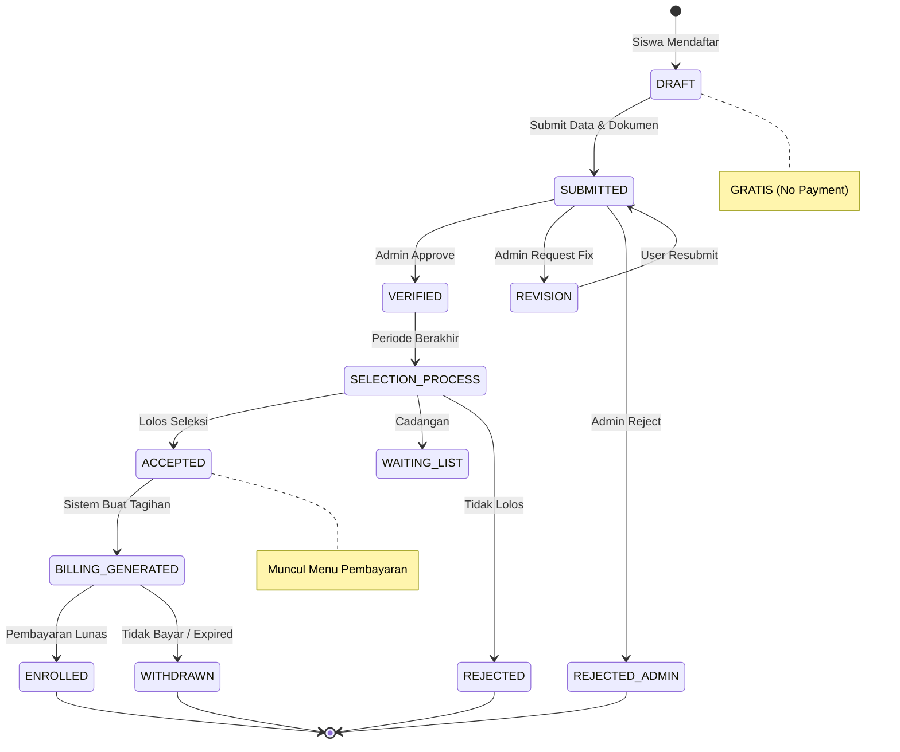
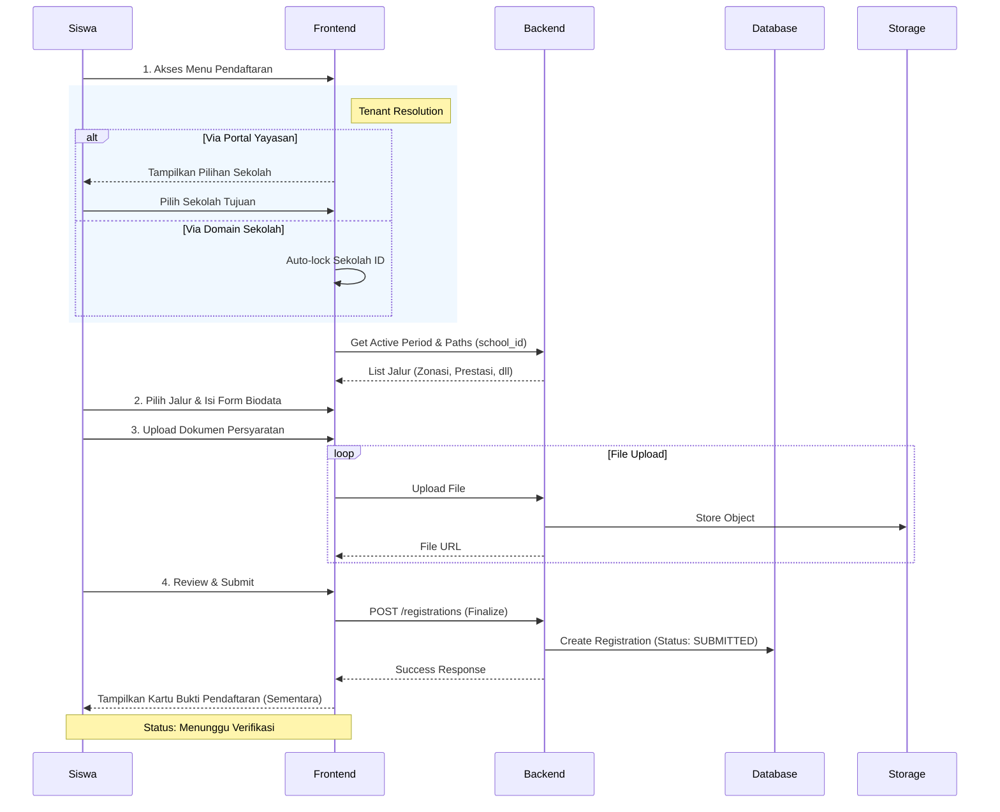
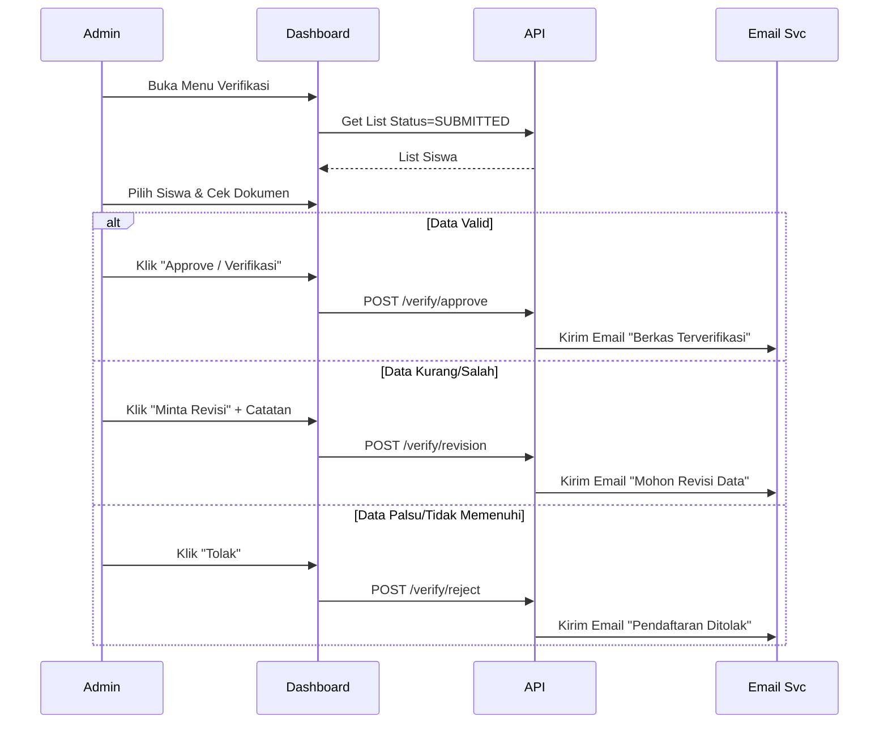
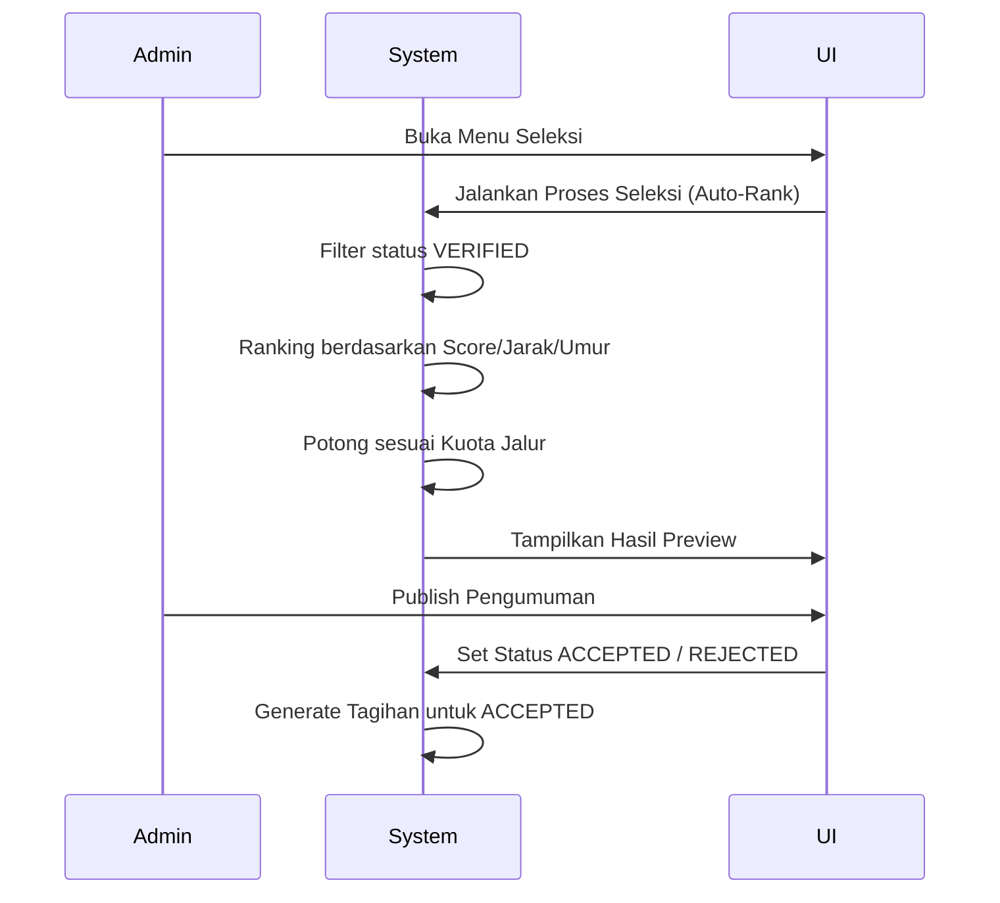
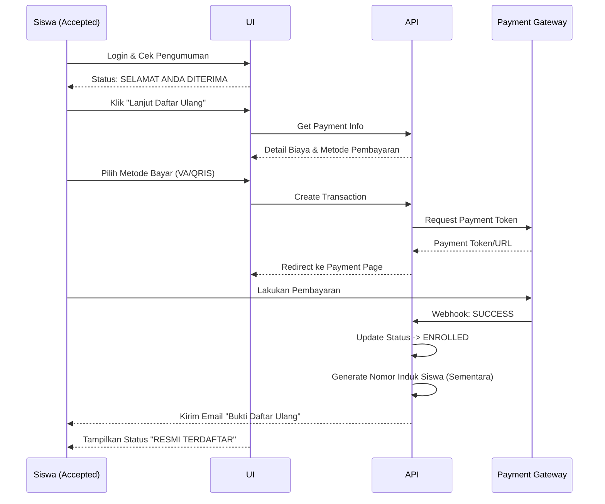

# Technical Design Document (TDD) - PPDB SaaS Platform (Part 2)

**Version:** 2.0.0 (Information Architecture & User Flows)  
**Date:** 2025-12-26  
**Status:** Draft  
**Reference:** Extends [02. TDD-PPDB-SAAS.md](./02.%20TDD-PPDB-SAAS.md)

## Overview

Dokumen ini berfokus pada **Information Architecture (IA)** dan **User Experience (UX) Flows** detail untuk platform PPDB SaaS. Dokumen ini juga mendefinisikan model bisnis spesifik di mana **pembayaran dilakukan setelah siswa dinyatakan DITERIMA (Accepted)**.

---

## 1. Information Architecture (IA)

Struktur hierarki informasi dan navigasi dalam aplikasi PPDB SaaS.

### Sitemap & Navigation Structure

```mermaid
graph TD
    root[PPDB SaaS Platform]
    
    subgraph "Public Zone"
        root --> Landing[Landing Page]
        Landing --> Search[Cari Sekolah]
        Landing --> Info[Informasi PPDB]
        Landing --> Auth[Authentication]
        Auth --> Login
        Auth --> Register
        Auth --> Forgot[Forgot Password]
    end

    subgraph "Student Portal"
        root --> Student[Student Dashboard]
        Student --> S_Profile[Profile Siswa]
        Student --> S_Reg[Pendaftaran]
        S_Reg --> S_Form[Form Biodata]
        S_Reg --> S_Docs[Upload Dokumen]
        S_Reg --> S_Status[Cek Status]
        Student --> S_Payment[Pembayaran]
        S_Payment --> S_Invoice[Tagihan Daftar Ulang]
        S_Payment --> S_History[Riwayat Transaksi]
        Student --> S_Help[Bantuan]
    end

    subgraph "School Admin Portal"
        root --> Admin[School Dashboard]
        Admin --> A_Config[Konfigurasi PPDB]
        A_Config --> A_Periods[Periode & Gelombang]
        A_Config --> A_Paths[Jalur & Kuota]
        Admin --> A_Ops[Operasional]
        A_Ops --> A_Verify[Verifikasi Dokumen]
        A_Ops --> A_Select[Seleksi Siswa]
        A_Ops --> A_Announce[Pengumuman]
        Admin --> A_Fin[Keuangan]
        A_Fin --> A_Report[Laporan Pembayaran]
        Admin --> A_Users[Manajemen User]
    end

    subgraph "Super Admin Portal"
        root --> Super[Super Admin]
        Super --> SA_Tenants[Manajemen Sekolah]
        Super --> SA_Subs[Subscription]
    end

    style root fill:#1a237e,color:#fff
    style Landing fill:#0d47a1,color:#fff
    style Student fill:#2e7d32,color:#fff
    style Admin fill:#e65100,color:#fff
    style Super fill:#4a148c,color:#fff
```

---

## 2. Core Business Logic: Post-Acceptance Payment

Model bisnis yang diterapkan adalah **pembayaran di akhir (Post-Acceptance)**. Pendaftaran awal tidak dikenakan biaya.

### State Transition Diagram

---

## 3. User Flows per Feature

Berikut adalah detail alur pengguna (User Flow) untuk fitur-fitur utama berdasarkan Information Architecture di atas.

### 3.1. User Flow: Pendaftaran Siswa (Registration)
**Tujuan:** Siswa melengkapi data diri dan berkas. Sistem menangani pemilihan sekolah berdasarkan domain akses (Multi-tenant).

**Logika Pemilihan Sekolah (Tenant Resolution):**
1.  **Akses via Portal Yayasan (e.g., `ppdb.yayasan.id`):** User **WAJIB** memilih Jenjang (SD/SMP/SMA) dan Unit Sekolah tujuan sebelum mengisi formulir.
2.  **Akses via Domain Sekolah (e.g., `sma1.sekolah.id`):** Sistem **OTOMATIS** mengunci pilihan sekolah sesuai domain yang diakses. User langsung diarahkan ke pemilihan jalur tanpa memilih sekolah lagi.

### 3.2. User Flow: Verifikasi Dokumen (Verification)
**Tujuan:** Admin sekolah memeriksa kevalidan data siswa sebelum masuk tahap seleksi.

### 3.3. User Flow: Seleksi & Pengumuman
**Tujuan:** Menentukan siswa yang diterima berdasarkan kuota.

### 3.4. User Flow: Pembayaran Daftar Ulang (Enrollment)
**Tujuan:** Siswa yang diterima melakukan pembayaran untuk finalisasi status menjadi siswa sekolah.

---

## 4. Database Schema Implications

Perubahan struktur data untuk mendukung Information Architecture dan Flow di atas.

### Table: Registrations
Penambahan field untuk tracking status secara presisi.
- `status`: ENUM ('DRAFT', 'SUBMITTED', 'REVISION', 'VERIFIED', 'ACCEPTED', 'WAITING_LIST', 'REJECTED', 'ENROLLED', 'WITHDRAWN')
- `selection_rank`: Integer (Ranking hasil seleksi)
- `selection_score`: Decimal (Skor akhir seleksi)

### Table: Payments
Tabel pembayaran hanya terisi jika siswa sudah tahap daftar ulang.
- `payment_type`: DEFAULT 'DAFTAR_ULANG'
- `is_refundable`: Boolean (False, biasanya daftar ulang tidak kembali)

---

## 5. Security & Access Control (IA Perspective)

Hak akses berdasarkan arsitektur informasi:

1.  **Public Zone**: Accessible by `Guest`.
2.  **Student Portal**:
    *   `Auth Guard`: Requires valid JWT.
    *   `Payment Menu`: Visible ONLY if `status == ACCEPTED`.
    *   `Registration Edit`: Locked if `status == SUBMITTED | VERIFIED`. Unlocked if `REVISION`.
3.  **School Admin Portal**:
    *   `Tenant Guard`: Admin hanya bisa akses data sekolahnya sendiri.
    *   `Selection Menu`: Restricted to `Headmaster` or `PPDB Chairman`.
