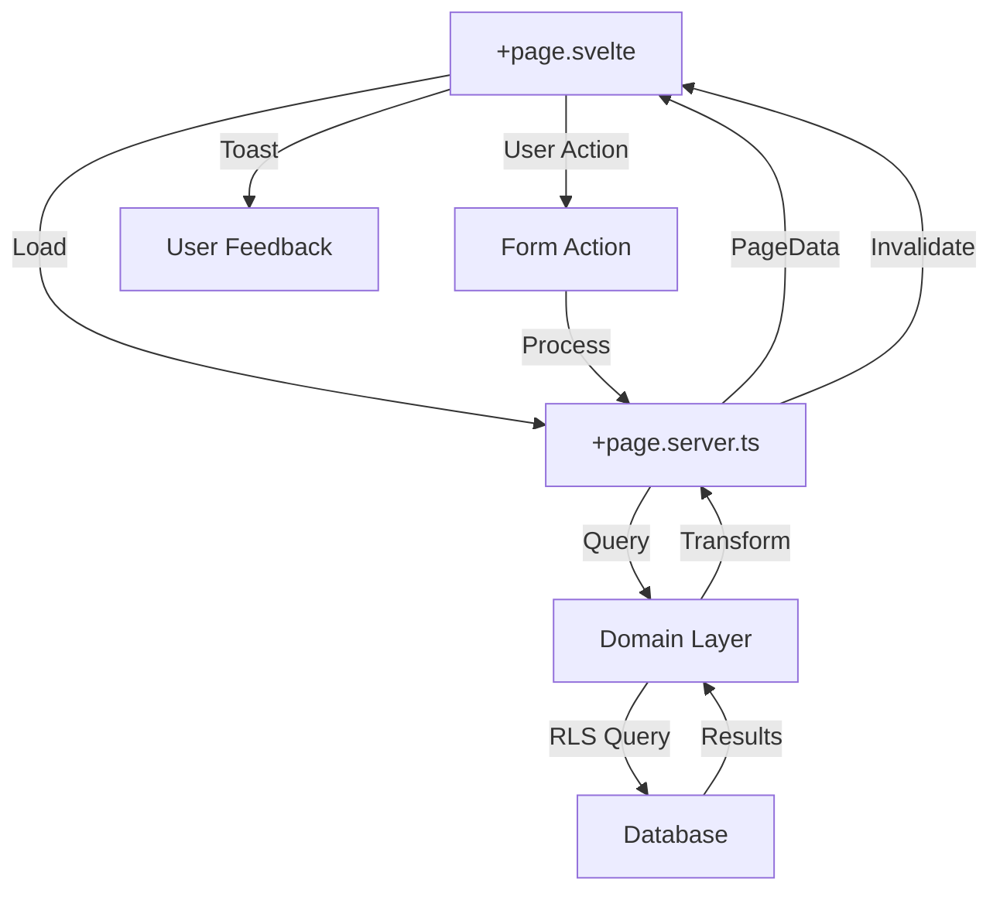

# Design Document: Admin Schools Enhancement

## Overview

This design document outlines the technical architecture and implementation approach for enhancing the Super Admin Schools Management page. The enhancement transforms the existing basic CRUD interface into a production-ready, feature-rich dashboard with bulk operations, advanced analytics, export capabilities, and comprehensive accessibility support.

### Goals

1. **Code Quality**: Remove technical debt, fix linting issues, and establish maintainable patterns
2. **User Experience**: Provide immediate feedback, loading states, and error recovery
3. **Productivity**: Enable bulk operations and quick preview to reduce administrative overhead
4. **Insights**: Deliver actionable statistics and export capabilities for data analysis
5. **Accessibility**: Ensure WCAG AA compliance for inclusive access
6. **Reliability**: Achieve comprehensive test coverage and error handling

### Non-Goals

- Redesigning the overall admin dashboard layout
- Implementing real-time WebSocket updates (polling is sufficient)
- Adding school creation wizard (existing flow is adequate)
- Multi-language support (English only for this phase)

## Architecture

### Component Structure

```
src/routes/admin/schools/
├── +page.svelte                 # Main page (refactored)
├── +page.server.ts              # Server load & actions (enhanced)
├── components/
│   ├── SchoolsTable.svelte      # Table with bulk selection
│   ├── StatsCards.svelte        # Enhanced statistics display
│   ├── BulkActionToolbar.svelte # Bulk operations UI
│   ├── QuickPreviewModal.svelte # School details modal
│   ├── ExportButton.svelte      # CSV export trigger
│   ├── FilterBar.svelte         # Advanced filtering
│   └── ActivityTimeline.svelte  # Audit trail display
```

### Data Flow



### State Management

- **Server State**: Managed via SvelteKit's load function and form actions
- **Client State**: Managed via Svelte 5 runes ($state, $derived)
- **Selection State**: Array of selected tenant IDs in component state
- **Filter State**: Synchronized with URL search parameters
- **Modal State**: Boolean flag for quick preview visibility

## Components and Interfaces

### 1. Enhanced Main Page (+page.svelte)

**Responsibilities:**
- Orchestrate child components
- Manage selection state for bulk operations
- Handle toast notifications
- Coordinate filter and pagination state

**Key State:**
```typescript
let selectedIds = $state<string[]>([]);
let showPreview = $state(false);
let previewTenantId = $state<string | null>(null);
let isExporting = $state(false);
```

**Props from Server:**
```typescript
interface PageData {
  tenants: PaginatedTenants;
  stats: EnhancedStats;
}

interface PaginatedTenants {
  data: Tenant[];
  total: number;
  page: number;
  totalPages: number;
  activeCount: number;
}

interface EnhancedStats {
  total: number;
  active: number;
  newThisMonth: number;
  totalRevenue: number;
  avgApplications: number;
}
```

### 2. SchoolsTable Component

**Purpose**: Display schools in a table with selection checkboxes and action menus.

**Props:**
```typescript
interface SchoolsTableProps {
  tenants: Tenant[];
  selectedIds: string[];
  onSelect: (id: string) => void;
  onSelectAll: (selected: boolean) => void;
  onPreview: (id: string) => void;
  onToggleStatus: (id: string, currentStatus: string) => void;
}
```

**Features:**
- Checkbox column for bulk selection
- "Select All" checkbox in header
- Row hover states with visual feedback
- Accessible keyboard navigation
- Loading skeleton during data fetch

### 3. StatsCards Component

**Purpose**: Display key metrics with trend indicators and visual hierarchy.

**Props:**
```typescript
interface StatsCardsProps {
  stats: EnhancedStats;
  isLoading?: boolean;
}
```

**Layout:**
- Grid of 5 cards (responsive: 1 col mobile, 3 cols tablet, 5 cols desktop)
- Each card shows: Icon, Label, Value, Trend (if applicable)
- Skeleton loaders during initial load

**Metrics:**
1. Total Schools (neutral trend)
2. Active Schools (percentage badge)
3. New This Month (growth indicator)
4. Total Revenue (formatted currency)
5. Avg Applications (per school)

### 4. BulkActionToolbar Component

**Purpose**: Provide bulk operation controls when schools are selected.

**Props:**
```typescript
interface BulkActionToolbarProps {
  selectedCount: number;
  onActivate: () => Promise<void>;
  onDeactivate: () => Promise<void>;
  onClearSelection: () => void;
}
```

**UI:**
- Fixed position at bottom of viewport (mobile) or below table header (desktop)
- Shows selected count
- Action buttons: Activate, Deactivate, Clear Selection
- Loading states during bulk operations
- Confirmation dialog for destructive actions

### 5. QuickPreviewModal Component

**Purpose**: Display school details without navigation.

**Props:**
```typescript
interface QuickPreviewModalProps {
  tenantId: string;
  open: boolean;
  onClose: () => void;
}
```

**Content Sections:**
1. **Header**: School name, logo, status badge
2. **Stats**: Applications, Paid Invoices, Created Date
3. **Profile**: Description, Contact Info, Subdomain
4. **Activity Timeline**: Last 10 actions with timestamps
5. **Quick Actions**: View as Admin, Toggle Status buttons

**Data Loading:**
- Fetch detailed data on modal open
- Show skeleton while loading
- Cache result for 5 minutes

### 6. ExportButton Component

**Purpose**: Trigger CSV export of school data.

**Props:**
```typescript
interface ExportButtonProps {
  filters: FilterState;
  onExport: () => Promise<void>;
}
```

**Behavior:**
- Disabled during export
- Shows loading spinner when processing
- Triggers browser download on completion
- Respects current filters and search
- Logs export action to audit trail

### 7. FilterBar Component

**Purpose**: Provide advanced filtering controls.

**Props:**
```typescript
interface FilterBarProps {
  currentFilters: FilterState;
  onFilterChange: (filters: FilterState) => void;
}
```

**Filters:**
- Status dropdown (All, Active, Inactive)
- Date range picker (Created Date)
- Application count range slider
- Payment status filter
- Active filters displayed as removable chips
- "Clear All" button

### 8. ActivityTimeline Component

**Purpose**: Display chronological audit trail.

**Props:**
```typescript
interface ActivityTimelineProps {
  tenantId: string;
  limit?: number;
}
```

**Timeline Items:**
```typescript
interface TimelineItem {
  id: string;
  action: 'created' | 'activated' | 'deactivated' | 'updated';
  actor: string;
  timestamp: Date;
  details?: Record<string, any>;
}
```

**UI:**
- Vertical timeline with icons
- Relative timestamps ("2 hours ago")
- Actor name and action description
- Expandable details for complex actions

## Data Models

### Enhanced Tenant Model

```typescript
interface Tenant {
  id: string;
  name: string;
  slug: string;
  status: 'active' | 'inactive';
  createdAt: Date;
  updatedAt: Date;
  stats: {
    applications: number;
    paidInvoices: number;
  };
  profile?: {
    logo?: string;
    description?: string;
    contactEmail?: string;
    contactPhone?: string;
  };
}
```

### Filter State Model

```typescript
interface FilterState {
  search?: string;
  status?: 'all' | 'active' | 'inactive';
  dateFrom?: Date;
  dateTo?: Date;
  applicationsMin?: number;
  applicationsMax?: number;
  paymentStatus?: 'all' | 'has_paid' | 'no_paid';
}
```

### Bulk Operation Result

```typescript
interface BulkOperationResult {
  success: number;
  failed: number;
  errors: Array<{
    tenantId: string;
    tenantName: string;
    error: string;
  }>;
}
```

### Export Data Model

```typescript
interface ExportRow {
  name: string;
  slug: string;
  status: string;
  applications: number;
  paidInvoices: number;
  createdDate: string;
  subdomain: string;
}
```

## Correctness Properties

*A property is a characteristic or behavior that should hold true across all valid executions of a system—essentially, a formal statement about what the system should do. Properties serve as the bridge between human-readable specifications and machine-verifiable correctness guarantees.*

### Property 1: Selection Consistency

*For any* set of selected tenant IDs, the selection state should remain consistent across re-renders and the "Select All" checkbox should accurately reflect whether all visible items are selected.

**Validates: Requirements 5.1, 5.2**

### Property 2: Filter URL Synchronization

*For any* filter state change, the URL search parameters should be updated to match, and navigating to a URL with filter parameters should restore the exact filter state.

**Validates: Requirements 12.7**

### Property 3: Bulk Operation Atomicity

*For any* bulk operation, if any individual operation fails, the system should continue processing remaining items and provide a detailed summary of successes and failures.

**Validates: Requirements 5.6, 5.7**

### Property 4: Export Data Completeness

*For any* export operation, the generated CSV should contain exactly the schools that match the current filters, with all required columns present and properly formatted.

**Validates: Requirements 6.2, 6.3, 6.4**

### Property 5: Loading State Visibility

*For any* async operation (data fetch, form submission, bulk action), a loading indicator should be visible from operation start until completion or error.

**Validates: Requirements 3.1, 3.2, 3.3**

### Property 6: Error Recovery Preservation

*For any* failed operation, user input and selection state should be preserved, allowing the user to retry without re-entering data.

**Validates: Requirements 2.3**

### Property 7: Accessibility Keyboard Navigation

*For any* interactive element, keyboard navigation (Tab, Enter, Escape) should provide equivalent functionality to mouse interaction.

**Validates: Requirements 8.4**

### Property 8: Toast Notification Uniqueness

*For any* operation result, exactly one toast notification should be displayed, and it should automatically dismiss after a timeout or user action.

**Validates: Requirements 3.4**

### Property 9: Audit Trail Immutability

*For any* status change or bulk operation, an audit log entry should be created that cannot be modified or deleted through the UI.

**Validates: Requirements 11.5**

### Property 10: Statistics Accuracy

*For any* displayed statistic, the value should match the result of the corresponding database query within the cache validity period.

**Validates: Requirements 4.1, 4.2, 4.3, 4.4, 4.5**

## Error Handling

### Error Categories

1. **Network Errors**: Connection failures, timeouts
2. **Validation Errors**: Invalid input, constraint violations
3. **Authorization Errors**: Insufficient permissions
4. **Business Logic Errors**: Quota exceeded, invalid state transitions
5. **System Errors**: Database failures, unexpected exceptions

### Error Handling Strategy

**Client-Side:**
```typescript
try {
  const result = await fetch('/api/endpoint');
  if (!result.ok) {
    throw new Error(await result.text());
  }
  toast.success('Operation completed');
} catch (error) {
  toast.error(getErrorMessage(error));
  console.error('Operation failed:', error);
}
```

**Server-Side:**
```typescript
export const actions = {
  bulkActivate: async ({ request, locals }) => {
    try {
      const auth = await requireAuth(locals);
      requireSuperAdmin(auth);
      
      const formData = await request.formData();
      const tenantIds = JSON.parse(formData.get('tenantIds'));
      
      const results = await bulkUpdateTenantStatus(
        tenantIds,
        'active',
        auth.userId
      );
      
      return { success: true, results };
    } catch (error) {
      console.error('Bulk activate failed:', error);
      return fail(500, {
        message: 'Failed to activate schools',
        error: error.message
      });
    }
  }
};
```

### User-Friendly Error Messages

```typescript
const ERROR_MESSAGES: Record<string, string> = {
  NETWORK_ERROR: 'Unable to connect. Please check your internet connection.',
  UNAUTHORIZED: 'You do not have permission to perform this action.',
  VALIDATION_ERROR: 'Please check your input and try again.',
  TENANT_NOT_FOUND: 'School not found. It may have been deleted.',
  BULK_PARTIAL_FAILURE: 'Some operations failed. See details below.',
  EXPORT_FAILED: 'Failed to generate export file. Please try again.',
};
```

### Retry Logic

```typescript
async function fetchWithRetry(
  url: string,
  options: RequestInit,
  maxRetries = 3
): Promise<Response> {
  for (let i = 0; i < maxRetries; i++) {
    try {
      const response = await fetch(url, options);
      if (response.ok) return response;
      if (response.status >= 500 && i < maxRetries - 1) {
        await delay(1000 * Math.pow(2, i)); // Exponential backoff
        continue;
      }
      throw new Error(`HTTP ${response.status}`);
    } catch (error) {
      if (i === maxRetries - 1) throw error;
      await delay(1000 * Math.pow(2, i));
    }
  }
  throw new Error('Max retries exceeded');
}
```

## Testing Strategy

### Unit Tests

**Target**: Individual functions and utilities

**Tools**: Vitest

**Coverage:**
- Filter state transformation functions
- CSV generation logic
- Error message formatting
- Date formatting utilities
- Selection state management helpers

**Example:**
```typescript
describe('filterStateToUrlParams', () => {
  it('should convert filter state to URL search params', () => {
    const filters: FilterState = {
      search: 'test',
      status: 'active',
      dateFrom: new Date('2024-01-01')
    };
    const params = filterStateToUrlParams(filters);
    expect(params.get('search')).toBe('test');
    expect(params.get('status')).toBe('active');
    expect(params.get('dateFrom')).toBe('2024-01-01');
  });
});
```

### Integration Tests

**Target**: Server actions and database interactions

**Tools**: Vitest + Test Database

**Coverage:**
- Bulk status update operations
- Export data generation
- Statistics calculation
- Audit trail creation
- Filter query construction

**Example:**
```typescript
describe('bulkUpdateTenantStatus', () => {
  it('should update multiple tenants and create audit logs', async () => {
    const tenantIds = [tenant1.id, tenant2.id];
    const result = await bulkUpdateTenantStatus(
      tenantIds,
      'active',
      adminUserId
    );
    
    expect(result.success).toBe(2);
    expect(result.failed).toBe(0);
    
    const logs = await getAuditLogs({ tenantIds });
    expect(logs).toHaveLength(2);
    expect(logs[0].action).toBe('activated');
  });
});
```

### E2E Tests

**Target**: Complete user workflows

**Tools**: Playwright

**Coverage:**
- Search and filter schools
- Select multiple schools and perform bulk activation
- Export filtered data to CSV
- Open quick preview modal and view details
- Toggle individual school status
- Navigate pagination

**Example:**
```typescript
test('bulk activate schools', async ({ page }) => {
  await page.goto('/admin/schools');
  
  // Select multiple schools
  await page.getByRole('checkbox', { name: 'Select school 1' }).check();
  await page.getByRole('checkbox', { name: 'Select school 2' }).check();
  
  // Perform bulk activation
  await page.getByRole('button', { name: 'Activate Selected' }).click();
  await page.getByRole('button', { name: 'Confirm' }).click();
  
  // Verify success toast
  await expect(page.getByText('2 schools activated')).toBeVisible();
  
  // Verify status badges updated
  await expect(page.getByText('Active').first()).toBeVisible();
});
```

### Accessibility Tests

**Target**: WCAG AA compliance

**Tools**: axe-core + Playwright

**Coverage:**
- Color contrast ratios
- Keyboard navigation
- ARIA labels and roles
- Focus management
- Screen reader compatibility

**Example:**
```typescript
test('schools page is accessible', async ({ page }) => {
  await page.goto('/admin/schools');
  const results = await injectAxe(page);
  expect(results.violations).toHaveLength(0);
});
```

### Property-Based Tests

**Target**: Correctness properties

**Tools**: fast-check (JavaScript property testing library)

**Configuration**: Minimum 100 iterations per test

**Example:**
```typescript
import fc from 'fast-check';

test('Property 2: Filter URL Synchronization', () => {
  fc.assert(
    fc.property(
      fc.record({
        search: fc.option(fc.string()),
        status: fc.option(fc.constantFrom('all', 'active', 'inactive')),
        dateFrom: fc.option(fc.date())
      }),
      (filters) => {
        const url = filtersToUrl(filters);
        const restored = urlToFilters(url);
        expect(restored).toEqual(filters);
      }
    ),
    { numRuns: 100 }
  );
});
```

**Tag Format**: `// Feature: admin-schools-enhancement, Property 2: Filter URL Synchronization`

## Implementation Notes

### Constants

```typescript
// src/lib/constants/admin.ts
export const PAGINATION_LIMIT = 20;
export const POLLING_INTERVAL = 60000; // 60 seconds
export const SEARCH_DEBOUNCE = 300; // milliseconds
export const TOAST_DURATION = 5000; // milliseconds
export const CACHE_TTL = 300; // 5 minutes
export const MAX_BULK_OPERATIONS = 50;
export const TENANT_ID_DISPLAY_LENGTH = 8;
```

### Design System Integration

All components must use Shadcn/UI components and design tokens:

```typescript
// Primary color (Kemdikbud Blue)
--primary: #002C5F;
--primary-foreground: #FFFFFF;

// Border radius
--radius: 1rem;

// Spacing (8px base unit)
--spacing-unit: 0.5rem;
```

### Performance Optimizations

1. **Debounced Search**: 300ms delay before triggering search
2. **Virtual Scrolling**: For tables with >100 rows
3. **Lazy Loading**: Quick preview modal content loaded on demand
4. **Memoization**: Statistics calculations cached
5. **Optimistic Updates**: UI updates before server confirmation

### Cleanup Patterns

```typescript
$effect(() => {
  const interval = setInterval(() => {
    invalidate('admin:tenants');
  }, POLLING_INTERVAL);
  
  return () => clearInterval(interval); // Cleanup
});

$effect(() => {
  const timer = setTimeout(() => {
    updateFilters();
  }, SEARCH_DEBOUNCE);
  
  return () => clearTimeout(timer); // Cleanup
});
```
