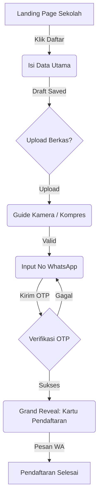

# UX Design Specification ppdb

**Author:** Kodrat
**Date:** 2025-12-30

---

<!-- UX design content will be appended sequentially through collaborative workflow steps -->

## Executive Summary

### Project Vision

Menciptakan standar baru PPDB Digital di Indonesia dengan estetika "Clean-Gen Z" yang dipadukan dengan wibawa warna institusional Kemdikbudristek. Fokus pada kecepatan (Edge performance) dan kesederhanaan akses pendaftar.

### Target Users

- **Orang Tua/Calon Siswa (Gen Z oriented):** Pengguna mobile-first yang menghargai kecepatan dan transparansi status pendaftaran.
- **Admin Yayasan/Sekolah:** Profesional yang membutuhkan efisiensi dan keakuratan data dalam manajemen multi-tenant.

### Key Design Challenges

- Menyeimbangkan identitas visual pemerintah yang formal dengan tren desain modern yang minimalis.
- Optimalisasi visual untuk akses pada perangkat dengan spesifikasi rendah dan sinyal tidak stabil.
- Membangun kepercayaan melalui UI yang transparan mengenai enkripsi data (UU PDP).

### Design Opportunities

- Implementasi sistem pendaftaran berbasis "Stories" atau progresif yang interaktif.
- Penggunaan palet warna kemdikbud sebagai elemen kepercayaan (Trust element) yang dipadukan dengan tipografi modern (Outfit/Inter).

## Core User Experience

### Defining Experience

Pengalaman pendaftaran dirancang dengan sistem "Fill Utility First" (Hybrid-Progressive). Pendaftar tidak dipaksa untuk melakukan registrasi akun secara formal di awal, melainkan langsung diarahkan untuk mengisi data dasar dan jalur sekolah yang dituju melalui subdomain sekolah yang spesifik. Akun otomatis terbentuk dan data dikunci saat verifikasi OTP WhatsApp/Email dilakukan di akhir alur pengisian data utama.

### Platform Strategy

- **Primary:** Mobile-first Web Application (SvelteKit). Dioptimalkan untuk browser mobile agar pendaftaran bisa dilakukan dimana saja.
- **Responsive Interface:** Layout yang menyesuaikan secara cerdas antara perangkat mobile (Ibu Maya) dan Desktop (Admin Sekolah).
- **Offline Resilience:** Pemanfaatan state management yang tangguh agar data pendaftar tidak hilang saat terjadi gangguan koneksi singkat.

### Effortless Interactions

- **Contextual Landing:** Subdomain sekolah (contoh: `sekolaha.ppdb.id`) langsung menampilkan visual sekolah yang relevan dengan skema warna Kemdikbud yang clean.
- **Smart Data Persistence:** Pendaftaran otomatis tersimpan di setiap langkah (Auto-save) untuk menangani kendala sinyal atau perangkat.
- **Guided Document Capture:** Antarmuka kamera dengan overlay panduan untuk menjamin kualitas dokumen yang diunggah, memudahkan verifikasi oleh admin.
- **Auto-Account Creation:** Penghapusan langkah pendaftaran akun tradisional yang membosankan. OTP dikirimkan sebagai bentuk penguncian data sekaligus verifikasi identitas di akhir proses.

### Critical Success Moments

- **The "Data Safe" Confirmation:** Momen saat pendaftar melihat tanda centang hijau dan menerima pesan WA "Data Anda Tersimpan Aman" tepat setelah pengisian form selesai.
- **Instant Status Clarity:** Pendaftar langsung mendapatkan dashboard sederhana berisi status verifikasi data tanpa perlu mencari-cari menu.

### Experience Principles

1. **Speed Over Formality:** Fokus pada penyelesaian tugas pendaftar dalam waktu kurang dari 5 menit, meminimalkan birokrasi aplikasi di awal.
2. **Trust via Accuracy:** Penggunaan palet biru resmi Kemdikbud pada elemen-elemen kritis untuk mempertegas aspek legalitas dan keamanan data.
3. **Gen Z Aesthetics:** Estetika bersih dengan tipografi modern (Outfit/Inter), layout berbasis kartu (card-based), dan mikro-interaksi responsif menggunakan Svelte Transitions.

## Desired Emotional Response

### Primary Emotional Goals

- **Lega (Relief):** Mengurangi beban kognitif dan stres pendaftar (Ibu Maya) melalui proses yang cepat dan tanpa hambatan.
- **Percaya (Trust):** Membangun rasa aman melalui identitas visual resmi Kemdikbud dan transparansi keamanan data sesuai UU PDP.
- **Bangga (Pride):** Memberikan kesan eksklusif dan modern bagi pendaftar (Gen Z) karena menggunakan sistem yang mutakhir.

### Emotional Journey Mapping

- **Discovery (Subdomain Sekolah):** Penasaran dan Terkesan (Visual sekolah yang bersih).
- **Registration (Core Action):** Fokus dan Lancar (Progressive disclosure tanpa hambatan login di awal).
- **Completion (Success):** Lega dan Tertolong (Konfirmasi instan via WA sebagai "bukti" pendaftaran).
- **Recovery (Saat ada kendala):** Tenang dan Terbimbing (Pesan error yang manusiawi dengan solusi nyata).

### Micro-Emotions

- **Confidence:** Rasa percaya diri saat mengunggah dokumen berkat panduan visual (overlay kamera).
- **Belonging:** Merasa "diterima" secara personal oleh sekolah tujuan melalui subdomain dan pesan personalisasi.
- **Dopamine Hit:** Rasa kecil keberhasilan saat melihat centang hijau di setiap langkah yang diselesaikan.

### Design Implications

- **Lega (Relief) →** Implementasi pesan sukses yang apresiatif dan fitur auto-save yang menjamin data tidak akan hilang ("Anti-Stres").
- **Percaya (Trust) →** Penggunaan palet biru resmi Kemdikbud pada elemen krusial dan gaya bahasa formal-sopan pada bagian privasi.
- **Bangga (Pride) →** Layout minimalis ala aplikasi modern (Instagram/TikTok style cards) yang jauh dari kesan kaku birokrasi lama.

### Emotional Design Principles

1. **The Human Balance:** Gunakan bahasa "Sopan-Berwibawa". Tim pengembang wajib menghindari jargon teknis yang mengintimidasi dalam pesan error.
2. **Contextual Tone:** Gunakan kehangatan pada elemen bantuan dan kepastian presisi pada elemen validasi data (NIK/Formulir).
3. **Reassurance over Error:** Setiap kendala sistem harus dibungkus dengan solusi ("Jangan khawatir, datamu aman, silakan coba lagi...").

## UX Pattern Analysis & Inspiration

### Inspiring Products Analysis

Analisis dilakukan terhadap produk yang memiliki standar tinggi dalam hal navigasi dan kepercayaan pengguna:

- **Traveloka/Tiket.com:** Menginspirasi alur pengisian form yang kompleks namun tetap terasa ringan melalui pembagian langkah yang jelas (Step-by-step progress).
- **Airbnb:** Menginspirasi kebersihan antarmuka (UI Cleanliness) dengan penggunaan whitespace yang luas dan tipografi yang kuat.
- **Instagram:** Menginspirasi kemudahan navigasi card-based dan mikro-interaksi yang disenangi audiens Gen Z.

### Transferable UX Patterns

- **Progressive Disclosure (Traveloka Style):** Memecah pendaftaran menjadi tahapan: _Pilih Sekolah -> Data Calon Siswa -> Unggah Dokumen -> Verifikasi_.
- **Visual Hierarchy (Airbnb Style):** Menonjolkan informasi kritis (Nama Sekolah, Status Pendaftaran) dengan kontras warna Kemdikbud yang elegan terhadap latar belakang putih bersih.
- **Card-Based Navigation (Gen Z Style):** Penggunaan kartu informasi yang interaktif untuk memilih jalur pendaftaran, memberikan kesan modern dan responsif.

### Anti-Patterns to Avoid

- **Information Overload:** Menghindari tampilan dashboard yang terlalu padat dengan teks kecil dan jargon birokrasi kaku ("Web Pemerintah Jadul").
- **Obscure Navigation:** Menghindari tombol tindakan (Call to Action) yang tidak jelas atau tersembunyi di bawah lipatan layar (below the fold).
- **Robot-Centric Error:** Menghindari pesan kesalahan teknis yang tidak memberikan solusi bagi pengguna awam.

### Design Inspiration Strategy

- **Adopt:** Pola _Skeleton Screens_ selama proses pemuatan data untuk memberikan persepsi kecepatan (Perceived Performance).
- **Adapt:** Alur "Booking" Traveloka disesuaikan menjadi alur "Pendaftaran" yang lebih personal dengan sentuhan warna institusional Kemdikbud.
- **Avoid:** Skema warna biru yang mendominasi seluruh layar; warna biru Kemdikbud hanya digunakan sebagai aksen otoritas pada elemen navigasi utama dan tombol aksi penting.

## Design System Foundation

### Design System Choice

**Shadcn/UI (Svelte version)**

### Rationale for Selection

- **Balance of Speed & Customization:** Memberikan keseimbangan sempurna antara kecepatan pengembangan dengan kemampuan kustomisasi penuh untuk mencapai estetika "Gen Z Clean" tanpa terlihat kaku seperti dashboard korporat.
- **Copy-Paste Architecture:** Karena komponen Shadcn bersifat _copy-paste_ ke dalam folder proyek, tim pengembang memiliki kontrol penuh atas kode UI, memudahkan integrasi warna Kemdikbud dan modifikasi gaya visual yang spesifik.
- **Accessibility & Reliability:** Dibangun di atas Radix UI (bits-ui untuk Svelte), memastikan komponen seperti Modal, Popover, dan Form memiliki aksesibilitas tinggi bagi semua pengguna.

### Implementation Approach

Menggunakan pustaka `shadcn-svelte` yang diintegrasikan langsung ke dalam struktur folder `$lib/components/ui/`. Komponen akan diatur melalui file `theme.css` global yang mengontrol variabel CSS (Design Tokens).

### Customization Strategy

- **Design Tokens:** Modifikasi variabel CSS untuk _border-radius_ yang lebih lebar (rounded-xl) dan bayangan halus (soft shadows) untuk kesan modern.
- **Typography:** Memprioritaskan font **Outfit** untuk judul dan **Inter** untuk teks body agar terlihat bersih dan profesional.
- **Color Injection:** Warna resmi Kemdikbud Biru (#002C5F atau variannya) akan dijadikan sebagai warna _Primary_ dalam sistem tema.

## 2. Core User Experience

### 2.1 Defining Experience: "The 5-Minute Quick Enrollment"

Interaksi inti ppdb adalah pendaftaran tanpa hambatan login di awal. Pendaftar langsung masuk ke alur pengisian data utama berkas sekolah. Pengalaman ini menggunakan pola "Draft-to-Commit", di mana data pendaftar tersimpan secara temporer (Safe Draft) selama proses pengisian, dan baru akan "meledak" menjadi registrasi resmi setelah verifikasi WhatsApp OTP di langkah terakhir.

### 2.2 User Mental Model

- **Pergeseran Paradigma:** Dari "Daftar Akun -> Verifikasi -> Isi Form" menjadi "Isi Form -> Verifikasi -> Akun Terbentuk Otomatis".
- **Ekspektasi:** Pengguna mengharapkan progres yang tidak hilang (State Persistence) meskipun koneksi terputus, mirip dengan draf pesan di aplikasi chat.

### 2.3 Success Criteria

- **Zero-Friction Entry:** Pengguna mencapai form isian NIK dalam kurang dari 2 klik dari halaman landing.
- **Micro-Closure:** Setiap tahapan form memberikan centang hijau instan ("Good Job!").
- **Verification Delight:** OTP diterima dalam <10 detik dan segera diikuti oleh tampilan 'Kartu Pendaftaran Resmi'.

### 2.4 Novel UX Patterns

- **Invisible Bot Protection:** Penggunaan Cloudflare Turnstile menggantikan Captcha tradisional, menjaga estetika Gen Z tetap bersih tanpa gangguan puzzle gambar.
- **The Progress Anchor:** Bar progres interaktif berwarna Kemdikbud Biru yang selalu terlihat di bagian atas, memberikan orientasi posisi pendaftar dalam alur 5 menit tersebut.

### 2.5 Experience Mechanics

1. **Initiation:** Klik "Daftar Cepat" di landing page sekolah melalui subdomain unik sekolah.
2. **Interaction:** Pengisian 3-4 langkah progresif (Data Dasar -> Unggah Berkas -> Pilih Jalur) menggunakan pola kartu (card-based).
3. **Feedback:** Animasi transisi Svelte yang mulus (Slide-in) antar langkah dan skeleton screens saat memuat data.
4. **Completion:** Verifikasi WA OTP -> Tampilan "Grand Reveal" Kartu Pendaftaran digital dengan animasi _fade-in_ yang elegan.
5. **Success Output:** Kartu Pendaftaran Prestisius dengan QR Code dinamis, tipografi premium (Outfit), dan opsi instan "Share to WhatsApp".

## Visual Design Foundation

### Color System

- **Primary (The Authority):** Deep Kemdikbud Blue (#002C5F). Digunakan sebagai warna identitas utama pada header, tombol aksi primer, dan elemen status resmi.
- **Secondary (The Modern Edge):** Vibrant Cerulean (#00AEEF). Digunakan untuk elemen interaktif, link, dan aksen visual yang memberikan kesan dinamis (Gen Z).
- **Background & Surfaces:**
  - _Light Mode (Default):_ Pure White (#FFFFFF) dengan Soft Gray (#F8FAFC) untuk memisahkan blok informasi secara bersih.
  - _Dark Mode (User Choice):_ Deep Navy/Charcoal (#0F172A) dengan aksen Biru Kemdikbud yang "elevated" agar tetap kontras.
- **Semantic Palette:** Success (Emerald-500), Error (Rose-500), Warning (Amber-500), Info (Sky-500).

### Typography System

- **Headings:** **Outfit** (Google Fonts). Dipilih karena bentuk geometrisnya yang modern, ramah, namun tetap terlihat berwibawa untuk institusi pendidikan.
- **Body & Interface:** **Inter** (Google Fonts). Standar industri untuk keterbacaan tinggi di berbagai resolusi layar, terutama pada perangkat mobile pendaftar.
- **Scale:** Modular Scale (Ratio 1.125) untuk menjaga hirarki tipografi yang harmonis dan tidak mengintimidasi.

### Spacing & Layout Foundation

- **Base Unit:** 8px Spacing System. Semua margin dan padding menggunakan kelipatan 8px untuk menjamin konsistensi visual.
- **Layout Style:** _Airy Card-Based Layout_. Informasi dikelompokkan dalam kartu-kartu dengan _border radius_ lebar (16px / rounded-2xl) untuk kesan aplikasi modern.
- **Responsive Strategy:** 12-column grid untuk admin dashboard (desktop), dan single-column stack yang lega untuk pendaftar (mobile-first).

### Accessibility Considerations

- **Contrast Ratios:** Minimal WCAG 2.1 Level AA (4.5:1) untuk semua teks fungsional terhadap latar belakangnya.
- **Touch Targets:** Minimum 44x44px untuk semua elemen interaktif guna memudahkan Ibu Maya melakukan navigasi menggunakan satu tangan.
- **Adaptive Dark Mode:** Memungkinkan pengguna berpindah mode tanpa kehilangan konteks visual, dengan deteksi preferensi sistem otomatis.

## Design Direction Decision

### Design Directions Explored

Kami mengeksplorasi dua arah visual utama: "The Balanced Official" (fokus pada otoritas Kemdikbud dan kejelasan birokrasi) dan "Gen Z Vibrant" (fokus pada energi anak muda dan estetika aplikasi modern). Eksplorasi dilakukan melalui prototipe interaktif HTML untuk membandingkan keterbacaan, beban kognitif, dan daya tarik visual bagi dua persona utama: Ibu Maya (Orang Tua) dan Rian (Calon Siswa Gen Z).

### Chosen Direction: "The Prestigious Hybrid"

Keputusan jatuh pada penggabungan fondasi **The Balanced Official** dengan elemen interaksi dan visual dari **Gen Z Vibrant**. Visual didominasi oleh Biru Kemdikbud Tua untuk membangun rasa percaya, namun diimplementasikan dalam layout kartu modern yang progresif dan dinamis.

### Design Rationale

- **Trust-first Architecture:** Penggunaan warna institusional Kemdikbud Blue (#002C5F) sebagai penjamin rasa aman bagi orang tua dalam memberikan data sensitif.
- **Modern Experience Standards:** Implementasi sudut membulat (rounded-2xl) dan spasi yang luas (airy positioning) untuk menghilangkan kesan "aplikasi pemerintah lama" yang kaku.
- **Clarity over Flashy:** Memberikan prioritas pada aksesibilitas dan keterbacaan data NIK/Dokumen, sembari menyisipkan elemen kegembiraan melalui mikro-interaksi Svelte yang halus.

### Implementation Approach

Implementasi visual dilakukan melalui sistem tema Shadcn/UI (Svelte) dengan konfigurasi desain:

- **Design Tokens:** `--radius: 1rem` (prestigious rounding), `--primary: #002C5F` (authority), `--accent: #00AEEF` (modern touch).
- **Responsive Handling:** Layout adaptif yang mengutamakan tampilan mobile (single-column card) namun tetap profesional di layar desktop admin yayasan.

## User Journey Flows

### Pendaftaran Cepat (The 5-Minute Enrollment)

Alur ini dirancang untuk memaksimalkan konversi dengan menghilangkan hambatan login di awal dan menggunakan pola pengisian data yang progresif.

### Pemantauan & Pembayaran (Post-Registration)

Fokus pada transparansi status dan kemudahan transaksi bagi orang tua setelah data mereka masuk ke dalam sistem.

1. **Entry Point:** Klik link "Cek Status" dari WhatsApp Notifikasi.
2. **Dashboard:** Tampilan progres verifikasi menggunakan bar berwarna Kemdikbud.
3. **Action:** Tombol "Bayar Biaya Pendaftaran" muncul saat status berubah menjadi 'Menunggu Pembayaran'.
4. **Completion:** Integrasi Payment Gateway dengan notifikasi sukses instan.

### Verifikasi Admin (Sekolah)

Memberikan efisiensi maksimal bagi admin sekolah dalam mengelola ribuan pendaftar.

1. **Queue Management:** Daftar pendaftar diurutkan berdasarkan prioritas dan waktu masuk.
2. **Decision Support:** Tampilan data diri dan scan dokumen secara berdampingan (side-by-side) untuk verifikasi cepat.
3. **Communication:** Tombol satu klik untuk mengirimkan pesan kustom atau template ke pendaftar via WhatsApp.

### Journey Patterns

- **Persistence Pattern:** Penggunaan _Local Storage_ dan _Draft State_ di server untuk memastikan progres pendaftaran tidak hilang.
- **Feedback Pattern:** Penggunaan mikro-copy yang personal ("Halo Ibu Maya") dan centang hijau di setiap akhir grup input.
- **Verification Pattern:** OTP WhatsApp sebagai pengunci akun final sekaligus validasi nomor kontak aktif.

### Flow Optimization Principles

1. **Simplify Entry:** Minimal klik untuk mulai mengisi data.
2. **Logical Grouping:** Input dikelompokkan secara tematis agar tidak terasa membanjiri layar.
3. **Contextual Guidance:** Panduan muncul hanya saat dibutuhkan (misal: saat mengunggah foto ijazah yang buram).

## Component Strategy

### Design System Components

Kami memanfaatkan pustaka **Shadcn/UI (Svelte)** sebagai fondasi komponen standar untuk menjamin aksesibilitas dan kecepatan pengembangan:

- **Form & Validation:** Integrasi `form` Shadcn dengan `zod` untuk validasi NIK dan data siswa secara real-time.
- **Layout:** `Card` sebagai kontainer utama informasi pendaftar dan `Separator` untuk menjaga kebersihan visual.
- **Navigation:** `Button` dengan varian "Primary" (Kemdikbud Blue) dan `Progress` bar yang menempel di bagian top viewport.
- **Feedback:** `Toast` untuk notifikasi sukses/gagal yang non-intrusif dan `Skeleton` untuk loading state.

### Custom Components

Beberapa komponen khusus dirancang untuk kebutuhan unik PPDB:

#### 1. Guided Camera Overlay

- **Purpose:** Membantu pendaftar mengambil foto dokumen (Ijazah/Akte) dengan sudut dan pencahayaan yang tepat.
- **Anatomy:** Viewport kamera dengan overlay garis pemandu (frame) transparan.
- **Interaction:** Memberikan peringatan teks jika posisi dokumen tidak presisi sebelum tombol jepret aktif.

#### 2. Prestigious Digital Card

- **Purpose:** Memberikan bukti pendaftaran yang membanggakan (Pride) dan eksklusif.
- **Usage:** Ditampilkan setelah verifikasi OTP berhasil (The Grand Reveal).
- **Anatomy:** Kartu dengan rasio mobile-ready, efek _glassmorphism_, Nama Siswa, Nomor Registrasi, dan QR Code dinamis.

#### 3. WhatsApp OTP Input

- **Purpose:** Verifikasi identitas yang super cepat tanpa hambatan keyboard.
- **States:** Default (4-6 empty slots), Active (Focus), Loading (Verifying), Error (Wrong code).
- **Behavior:** Auto-submit saat kolom terakhir terisi.

#### 4. Admin Side-by-Side Reviewer

- **Purpose:** Mempercepat proses verifikasi oleh admin sekolah.
- **Anatomy:** Split screen; Panel kiri berisi data isian formulir, panel kanan berfungsi sebagai _Image Viewer_ untuk dokumen asli.

### Component Implementation Strategy

- **Tokens-first:** Semua komponen kustom wajib menggunakan variabel CSS (`--primary`, `--radius`, dll) dari tema Shadcn agar konsisten.
- **Accessibility:** Setiap komponen kustom harus menyertakan `aria-labels` yang jelas, terutama pada bagian akses kamera.

### Implementation Roadmap

- **Phase 1 (MVP):** Form, Progress Bar, WhatsApp OTP Input (Kritis untuk alur 5 menit).
- **Phase 2 (UX Polish):** Prestigious Digital Card, Guided Camera Overlay (Meningkatkan kualitas data & kebanggaan).
- **Phase 3 (Admin Efficiency):** Side-by-Side Reviewer & Dashboard Analytics.

## UX Consistency Patterns

### Button Hierarchy

- **Primary Action (The Commander):** Biru Kemdikbud (#002C5F) dengan teks putih. Digunakan untuk tindakan tunggal paling penting di satu layar (misal: "Daftar Sekarang", "Terima Pendaftar").
- **Secondary Action (The Supporter):** Outline Biru Kemdikbud dengan latar belakang Putih/Transparan. Digunakan untuk tindakan alternatif (misal: "Kembali", "Lihat Contoh Dokumen").
- **Tertiary/Ghost Action:** Teks Biru Cerulean tanpa border. Digunakan untuk navigasi ringan atau bantuan (misal: "Butuh bantuan?", "Kebijakan Privasi").

### Feedback Patterns

- **Positive Feedback (Success):** Animasi centang hijau dan pesan sukses yang personal ("Data draf kamu sudah aman, [Nama]!").
- **Negative Feedback (Error):** Inline error messages yang deskriptif dan solutif. Hindari kode error teknis; gunakan bahasa manusia.
- **Transitional Feedback:** Penggunaan Skeleton Screens yang meniru struktur layout asli selama proses memuat data (fetching) untuk mengurangi kesan menunggu.

### Form Patterns

- **Progressive Input:** Menampilkan satu grup input dalam satu waktu (misal: Data Dasar dulu) untuk mencegah _form fatigue_.
- **Live Guidance:** Penjelasan singkat atau _tooltip_ yang muncul secara otomatis saat kursor berada di input yang sensitif (seperti NIK atau Penghasilan Orang Tua).
- **Auto-save Pulse:** Animasi "dot" kecil atau teks halus di footer yang berkedip setiap kali data tersimpan otomatis ke draf server.

### Navigation Patterns

- **Breadcrumbs/Step Indicator:** Indikator visual di bagian atas yang menunjukkan posisi pengguna dalam 5 langkah pendaftaran.
- **Deep Linking:** Setiap notifikasi WhatsApp menyertakan link unik yang langsung mengarahkan pendaftar ke halaman spesifik tanpa perlu navigasi manual dari dashboard.

### Additional Patterns

- **Empty States:** Ilustrasi minimalis dengan pesan inspiratif saat dashboard pendaftar belum memiliki data ("Mari mulai langkah pertamamu ke sekolah impian").
- **Clearance Pattern:** Menghilangkan elemen navigasi yang tidak perlu saat pendaftar sedang berada di dalam alur pengisian form (Focus Mode).

## Responsive & Accessibility Strategy

### 1. Visual Accessibility & Legibility

- **Contrast over Minimalism:** Adhere to WCAG AA standards. Primary text must use Kemdikbud Blue (#002C5F) on White/Light Grey backgrounds to ensure readability for older users (e.g., Ibu Maya).
- **Typography:** Minimum 16px font size for body text. 14px is allowed only for secondary metadata. Sans-serif fonts (Outfit/Inter) are prioritized for maximum legibility.
- **Touch Targets:** Semua elemen interaktif (tombol, link, input) wajib memiliki area sentuh minimal 44x44px untuk mencegah kesalahan "salah pencet" pada perangkat mobile.

### 2. 'HP Kentang' Optimization (Low-End Devices)

- **Performance Budget:** Batasan ketat pada ukuran bundle JS/CSS. Target muatan awal <200KB untuk memastikan kecepatan akses di jaringan 3G.
- **Asset Strategy:** Menggunakan format WebP yang terkompresi dan SVG. Implementasi _lazy-loading_ untuk aset non-kritis.
- **CSS-First Animations:** Menggunakan animasi "Pulse" dan "Skeleton" berbasis CSS murni, menghindari manipulasi JS yang membebani CPU perangkat low-end.
- **Low-Bandwidth Resiliency:** Memberikan umpan balik visual instan (loading states) saat koneksi lambat agar pengguna tahu sistem sedang bekerja.

### 3. Implementation (Tailwind & Shadcn)

- **Semantic Structure:** Menggunakan HTML5 semantik (`<main>`, `<nav>`, `<section>`) untuk mendukung keterbacaan oleh mesin dan alat bantu.
- **Accessible Components:** Memanfaatkan Shadcn (Radix UI) yang sudah mendukung navigasi keyboard dan ARIA labels secara bawaan.
- **Fluid Layouts:** Desain responsif mobile-first, bertransisi dari tampilan kolom tunggal (Mobile) ke tata letak multi-kolom (Admin Desktop).

### 4. The 'North Star' Goal: Zero Dead Ends

- **Inclusivity:** Setiap pengguna harus bisa menyelesaikan pendaftaran secara mandiri tanpa bantuan pihak ketiga.
- **Focus Management:** Perpindahan fokus otomatis ke pesan error atau dialog baru untuk memandu pengguna pembaca layar (screen reader).
- **Human-Centric Error Recovery:** Pesan error yang membantu ("NIK harus 16 digit, Anda baru memasukkan 15") menggantikan pesan kode teknis yang membingungkan.

### 5. Validation & Testing

- **Automated Audits:** Integrasi Axe-core dan Lighthouse dalam pipeline CI/CD (Target Skor Aksesibilitas: 95+).
- **Real-World Profiling:** Pengujian manual menggunakan profil "Mid-tier Mobile" dan simulasi jaringan "Slow 3G" di Chrome DevTools untuk menjamin fungsi di daerah rural.
